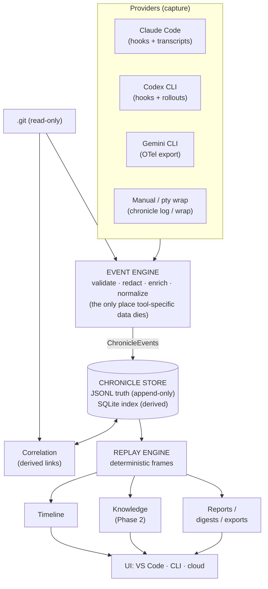

# Gigai Chronicle — Architecture Blueprint

> **Build software with AI. Never lose the journey.**
>
> Status: `v2 — REVISED after Phase-0 approval, final before implementation` · License: MIT (spec: CC-BY) · Date: 2026-07-14
> Supersedes v1. Revision record: [ARCHITECTURE-REVIEW.md](ARCHITECTURE-REVIEW.md). Companions: [PHASE-0.md](PHASE-0.md) (approved), [CAPTURE-SURFACES.md](CAPTURE-SURFACES.md), [SPEC-ROADMAP.md](SPEC-ROADMAP.md), [PROVIDERS.md](PROVIDERS.md), [VISION.md](VISION.md).

This document is the complete technical design for Gigai Chronicle. Every
section is a commitment, not a suggestion — changes after sign-off go through
an ADR in `knowledge/decisions/`.

**The v2 revision in one paragraph:** Gigai Chronicle is provider-agnostic by
constitution — Claude Code is the *first provider*, never the identity. The
center of the architecture is no longer a set of tool adapters; it is the
**Event Engine**, which normalizes everything into one first-class model,
**ChronicleEvent**, flowing through one pipeline:
`Providers → Event Engine → Chronicle Store → Replay Engine → Projections (Timeline, Knowledge, Reports) → UI`.
**Replay precedes Timeline** in both architecture and build order. The on-disk
directory is renamed to **`.chronicle/`** and the format is designed as a
public open standard from day one.

---

## Table of Contents

1. [What Gigai Chronicle Is (and Is Not)](#1-what-gigai-chronicle-is-and-is-not)
2. [Design Laws](#2-design-laws)
3. [System Overview: The Chronicle Pipeline](#3-system-overview-the-chronicle-pipeline)
4. [The Hard Problem: Capture](#4-the-hard-problem-capture)
5. [The ChronicleEvent Model](#5-the-chronicleevent-model)
6. [Identity Model: Project, Repository, Workspace](#6-identity-model-project-repository-workspace)
7. [On-Disk Format: the `.chronicle/` Spec](#7-on-disk-format-the-chronicle-spec)
8. [Chronicle Store (Storage Engine)](#8-chronicle-store-storage-engine)
9. [Event Engine](#9-event-engine)
10. [Replay Engine](#10-replay-engine)
11. [Correlation Engine](#11-correlation-engine)
12. [Monorepo Layout](#12-monorepo-layout)
13. [Core SDK — API Contract](#13-core-sdk--api-contract)
14. [CLI Design](#14-cli-design)
15. [VS Code / Cursor / Windsurf Extension](#15-vs-code--cursor--windsurf-extension)
16. [Provider & Plugin System](#16-provider--plugin-system)
17. [Sync Engine](#17-sync-engine)
18. [Security Model](#18-security-model)
19. [Performance Strategy](#19-performance-strategy)
20. [Offline Strategy](#20-offline-strategy)
21. [Testing Strategy](#21-testing-strategy)
22. [Versioning, Compatibility, Spec Governance](#22-versioning-compatibility-spec-governance)
23. [Roadmap: Development Order & Phase Mapping](#23-roadmap-development-order--phase-mapping)
24. [Decision Log: Resolved & Newly Open](#24-decision-log-resolved--newly-open)

---

## 1. What Gigai Chronicle Is (and Is Not)

**The product promise (canonical wording, used everywhere):**

> **Build software with AI. Never lose the journey.**

Gigai Chronicle is an **append-only log of ChronicleEvents describing your
AI-assisted development journey, living inside your repository**, plus an
engine to capture, replay, and understand it.

Git answers *"what changed and when."*
Gigai Chronicle answers *"why it changed, what was asked, what the AI
answered, what was accepted, what was decided — and lets you replay it."*

| | Git | Gigai Chronicle |
|---|---|---|
| Unit of truth | Commit (snapshot of code) | ChronicleEvent (moment in the journey) |
| Storage | `.git/` object database | `.chronicle/` plain-text event log |
| Derived views | branches, log, blame | replay, timeline, knowledge, reports |
| Sync | push/pull | **git itself** (default) or optional cloud |

**Provider-agnosticism is constitutional.** Chronicle is never tied to a
single AI tool. Claude Code is the *first supported provider* — chosen because
it has the best capture surface today ([PROVIDERS.md](PROVIDERS.md)) — but
nothing in the event model, the store, the replay engine, or any UI knows or
cares which provider produced an event. Any wording that couples the product
to one vendor's tool ("never lose another Claude Code session") is banned from
docs, marketing, and code comments. The test: **every provider name in this
document could be replaced by a competitor's and the architecture would not
change.**

**Explicit non-goals** (these keep the product honest for a decade):

- ❌ Not a chat client. **Core never calls a model.** Optional, clearly-labeled
  plugins may use the *user's own* keys or local models — off by default
  (Phase-0 amendment A6).
- ❌ Not a Git replacement or wrapper. We read Git; we never rewrite history.
- ❌ Not an autonomous agent. The extension **never modifies user code**.
- ❌ Not surveillance. Team analytics aggregate by project and practice —
  we never rank, score, or leaderboard individual developers (A8).
- ❌ Not a cloud product with a local mode. It is a **local product with an
  optional cloud**.
- ❌ Not a prompt manager. History and replay come first; the curated prompt
  library is a convenience projection, never the pitch (Phase-0 §3, v2).

---

## 2. Design Laws

These are non-negotiable invariants. Every PR is reviewed against them.

1. **The repo is the database.** Canonical data lives in `.chronicle/` as
   Markdown / JSON / JSONL / YAML. A user with `cat` and `grep` can read
   everything we store. No binary formats, no proprietary encodings.
2. **Append-only truth, disposable indexes.** The event log is the single
   source of truth. SQLite, digests, timelines are derived caches that can be
   deleted and rebuilt at any time (`chronicle doctor --reindex`).
3. **Everything is a ChronicleEvent.** If something happened in the journey
   and it isn't an event, it didn't happen. Providers may only speak to the
   system by emitting events through the Event Engine; surfaces may only learn
   about the journey by reading projections of events. No side channels.
4. **One-way pipeline.** Data flows `Providers → Event Engine → Chronicle
   Store → Replay Engine → Projections → UI` and never skips a layer upstream.
   The Timeline never talks to a provider. A provider never writes a file in
   the store directly.
5. **If it can't be replayed, it wasn't captured.** Replay is the acceptance
   test of capture: a provider integration is complete only when the Replay
   Engine can reconstruct its sessions. Fidelity limits are declared, not
   hidden ([PROVIDERS.md](PROVIDERS.md)).
6. **No shared mutable files.** Two machines, two branches, or two teammates
   must never produce a merge conflict inside `.chronicle/`. Achieved
   structurally (ULID filenames, single-writer JSONL, one-entity-per-file),
   not by conflict-resolution code.
7. **Zero network by default.** No telemetry, no update checks, no cloud calls
   unless the user explicitly configures them. `chronicle doctor` proves it.
8. **Capture degrades gracefully.** First-class hooks where tools offer them,
   log parsing where they don't, manual logging as the universal floor. A
   capture failure must never break the developer's actual workflow.
9. **Read Git, never write it** — with one opt-in exception: a
   `prepare-commit-msg` hook that appends a `Chronicle-Session:` trailer.
10. **Boring technology at the edges.** Node LTS, SQLite, system `git`,
    VS Code stable APIs. The innovation budget is spent on the event model,
    replay, and capture — not on infrastructure.

---

## 3. System Overview: The Chronicle Pipeline

v1 drew the system as a set of tool adapters around a storage core. v2
replaces that picture: **the architecture is a pipeline, and the Event Engine
is its center.**

```
Providers            (Claude Code, Codex CLI, Gemini CLI, manual, pty wrap, …)
   ↓  raw, tool-specific data
Event Engine         (validate → redact → enrich → normalize)   ← the ONLY normalizer
   ↓  ChronicleEvents
Chronicle Store      (append-only JSONL truth + disposable SQLite index)
   ↓  ordered event streams
Replay Engine        (deterministic reconstruction: frames of the journey)
   ↓  replay frames
Projections          Timeline · Knowledge · Reports  (all derived, all disposable)
   ↓
UI Surfaces          VS Code extension · chronicle CLI · (Phase 4) cloud
```



Layer rules (enforced by package dependency lint, §12):

- **Providers emit; they never store.** A provider's entire output surface is
  `emit(rawEvent)` into the Event Engine. Providers cannot touch the store,
  the index, or any UI. This is what makes provider #5 as cheap as provider #1.
- **The Event Engine is the only normalizer.** Tool-specific field names,
  formats, and quirks exist *only* inside a provider package and die at the
  Event Engine boundary. Downstream of the engine there is exactly one
  vocabulary: ChronicleEvents (§5).
- **The Timeline (and every other surface) never talks to providers.** The UI
  reads replay frames and index queries. If the Timeline needs data a provider
  isn't emitting, the fix is a new event type — never a UI-to-provider call.
- **Projections are disposable.** Timeline, knowledge extractions, digests,
  reports, and correlation links can all be deleted and regenerated from the
  store. Only the event log (and human-curated files, whose edits are
  themselves events) is truth.

Everything is a thin surface over one library: **`@gigaichronicle/core`**. The
extension, the CLI, and the cloud client are consumers of the same SDK. If a
feature can't be exercised from the CLI, it isn't in core.

---

## 4. The Hard Problem: Capture

Be clear-eyed: the genuinely hard engineering problem is not storage or UI —
it's **capturing prompt/response data from tools we don't control**. The
architecture treats capture as a pluggable **provider** layer with an explicit
degradation ladder. (Full per-tool audit: [CAPTURE-SURFACES.md](CAPTURE-SURFACES.md);
official capability matrix: [PROVIDERS.md](PROVIDERS.md).)

| Tier | Mechanism | Fidelity | Example |
|---|---|---|---|
| 1 | **Native hooks** — the tool calls us | Full, real-time | Claude Code hooks; Codex CLI hooks |
| 2 | **Transcript/log parsing** — we tail the tool's own session files | Full, near-real-time, version-fragile | Claude Code transcripts, Codex rollouts, Gemini OTel file export |
| 3 | **pty wrapper** — `chronicle wrap -- <tool>` records terminal I/O | Lossy (text stream), universal | Any CLI tool |
| 4 | **Manual** — `chronicle log`, extension "Log this" command | User-driven | Anything, incl. web chats |

Provider rules:

- Each provider is an isolated package (`packages/providers/*`) implementing
  one interface (`Provider`, §16). Providers translate tool-specific data into
  **raw event candidates** handed to the Event Engine — **no tool-specific
  fields survive past the engine**.
- Tier-2 parsers are **version-fingerprinted**: they detect the tool's log
  format version and fail soft (emit `CaptureDegraded`, keep working at tier
  3/4) rather than crash on a format change.
- Every provider declares its row in the capability matrix
  ([PROVIDERS.md](PROVIDERS.md)) — capture tier, replay fidelity, maintenance
  risk — and the UI surfaces those limits honestly.
- **Backfill**: every provider supports `chronicle import <provider>` to ingest
  historical sessions from the tool's existing logs, so a new user's first-run
  experience includes their past month of AI work, not an empty timeline.

---

## 5. The ChronicleEvent Model

### 5.1 One first-class model

**ChronicleEvent** is the atom of the entire system. Sessions, timelines,
digests, knowledge, benchmarks, reports — every one of them is either a stream
of ChronicleEvents or a projection computed from one. There is no second data
model.

```
Project 1──∞ Session 1──∞ ChronicleEvent
                │
                └── links → Git commits, branches, files   [derived projection]

Prompt library, Knowledge entries, Milestones               [curated files;
                                                             their edits are
                                                             recorded as events]
```

### 5.2 The envelope

Every event, from every provider, in every phase, uses one envelope:

```json
{
  "v": 1,
  "id": "evt_01J2X9GJ4K8Q6ZP3M7R5T1WNBC",
  "ts": "2026-07-14T10:32:11.412Z",
  "type": "PromptSubmitted",
  "session": "ses_01J2X9G8LKJH3G2F1D0S9A8P7O",
  "actor": { "kind": "human", "provider": "claude-code", "model": "claude-fable-5" },
  "git": { "head": "9fc1b2a", "branch": "feat/auth", "dirty": ["src/auth.ts"] },
  "payload": { "text": "Add refresh-token rotation to the auth middleware" },
  "meta": {
    "provider": "claude-code@1.0.0",
    "workspace": "wks_01J2XB2C3D4E5F6G7H8J9K0M1N",
    "schema": "PromptSubmitted/1",
    "visibility": "shared"
  }
}
```

- `id`: **ULID** with a type prefix (`evt_`, `ses_`, `prj_`, `wks_`, `prm_`,
  `dec_`, `req_`, `bmk_`). ULIDs are lexicographically time-sortable and need
  no coordination — two machines can generate IDs offline forever without
  collision.
- `v`: envelope schema version (integer). Readers must preserve unknown fields
  (forward compatibility) and refuse only on `v` greater than they understand.
- `actor.provider` / `meta.provider`: which provider observed the moment —
  provenance metadata, **never** a dispatch key downstream of the Event Engine.
- `git`: snapshot of repo state at event time — this powers correlation (§11).
- `payload`: typed per `type`, validated by JSON Schema from `packages/schema`
  (`meta.schema` names the payload schema + version).
- `meta.visibility`: `shared` (part of the committed record) or `local`
  (machine-local operational stream, §5.4).

### 5.3 Core event taxonomy (Chronicle Spec v1)

Event types are **PascalCase verbs of the journey** — provider-neutral by
construction. The core set:

| ChronicleEvent | Emitted when | Phase | Replaces (v1 name) |
|---|---|---|---|
| `ProjectCreated` | `chronicle init` establishes project identity | 1 | *(new)* |
| `ProjectOpened` | an engine opens the project on a workspace (throttled: ≤1/day/workspace) | 1 | *(new)* |
| `SessionStarted` / `SessionEnded` | an AI working session begins/ends | 1 | `session.started/ended` |
| `PromptSubmitted` | human submits a prompt | 1 | `prompt.submitted` |
| `PromptEdited` | human revises/resubmits a prior prompt | 1 | *(new)* |
| `AIResponseReceived` | the tool's response/turn completes | 1 | `prompt.responded` |
| `ToolExecuted` | agent ran a tool (bash, edit, search…) | 1 | `tool.invoked` |
| `FileModified` | files changed during a session (coalesced, debounced) | 1 | `file.changed` |
| `FilesAccepted` / `FilesRejected` | human accepts/rejects AI-produced changes | 1 | `prompt.accepted/rejected` |
| `GitCommitCreated` | a commit lands | 1 | `git.commit` |
| `GitPush` | a push happens | 1 | `git.push` |
| `BranchChanged` | branch created/switched (incl. checkout) | 1 | `git.branch` / `git.checkout` |
| `GitTagCreated` | a tag is created | 1 | `git.tag` |
| `LinkConfirmed` / `LinkRejected` | human confirms/severs a correlation link | 1 | `link.confirmed/rejected` |
| `CaptureGap` | we know we missed something (honesty is part of the record) | 1 | `capture.gap` |
| `CaptureDegraded` | a provider fell down the tier ladder | 1 | `capture.degraded` |
| `WorkspaceMoved` | a workspace's path changed (identity continuity, §6) | 1 | *(new)* |
| `KnowledgeExtracted` | a decision/requirement/TODO was extracted or curated | 2 | `knowledge.*` |
| `BenchmarkExecuted` | a benchmark suite ran | 3 | `benchmark.run` |
| `RegressionExecuted` | a prompt-regression suite ran | 3 | `regression.result` |
| `DeploymentDetected` | a deploy was recorded (CLI/CI) | 3 | `deploy.recorded` |

Extension events (provider- or plugin-specific moments that have no core
meaning) live in a sandboxed namespace: **`Ext.<providerId>.<EventName>`**
(e.g. `Ext.claude-code.SubagentStarted`), with payload schemas registered at
provider activation. Core, replay, and UI treat them as opaque timeline
entries; nothing downstream may depend on them.

The taxonomy is registered in `packages/schema` with one JSON Schema per type
and is the heart of Chronicle Spec v1 ([SPEC-ROADMAP.md](SPEC-ROADMAP.md)).
Phases 2–4 **add event types; they never change the envelope.**

### 5.4 Event visibility classes

Not every event belongs in the shared, committed record:

- **`shared`** — the journey itself: sessions, prompts, responses, tools,
  files, git moments, knowledge. Written to `sessions/` (committed, synced by
  git).
- **`local`** — operational noise meaningful only to one machine:
  `ProjectOpened`, `CaptureDegraded`, `WorkspaceMoved`, provider cursor
  bookkeeping. Written to `.local/ops/` (never committed). `CaptureGap` is
  deliberately **shared** — gaps are part of the honest record.

Private *sessions* (whole sessions the user keeps off the shared record until
promoted) are a separate mechanism: `.local/private/` + `chronicle session
promote` (Phase-0 amendment A2).

### 5.5 Prompt library (curated, versioned — Phase 2)

A *Prompt* in the library is distinct from a `PromptSubmitted` event: a
reusable, named, versioned asset, stored as Markdown with YAML frontmatter,
immutable versions under `versions/`. It is a curated projection of history —
useful, but deliberately **not** the product's identity (Phase-0 §3 v2) and
**not** in the MVP (see [ARCHITECTURE-REVIEW.md](ARCHITECTURE-REVIEW.md)).
Format spec unchanged from v1.

---

## 6. Identity Model: Project, Repository, Workspace

Folder names are ephemeral; identities must not be. **A path is never an
identity input.** Chronicle separates three identities:

| Identity | ID | Lives in | Lifetime |
|---|---|---|---|
| **Project** — the ongoing endeavour | `prj_<ULID>` | `.chronicle/config.json` (committed) | Permanent. Never changes, survives everything |
| **Repository** — the git history container | fingerprint (derived) | computed at open; cached in `.local/` and the index | Stable across remotes/renames; recomputed, never stored as truth |
| **Workspace** — one local working copy on one machine | `wks_<ULID>` | `.chronicle/.local/machine.json` (never committed) | One per clone/checkout; created on first open |

**Definitions:**

- **Project Identity** is minted once by `chronicle init` (`ProjectCreated`
  event) and travels with the repository forever because `config.json` is
  committed. Every clone, fork, and mirror of the repo carries the same
  `prj_` id. All shared events belong to the project.
- **Repository Identity** is a derived fingerprint:
  `sha256( sorted(root-commit SHAs) ∥ normalized remote URL set )`.
  Root commits are immutable, so the fingerprint survives remote renames and
  URL changes (the remote set updates; the root anchor holds). It exists to
  distinguish *"same project, same history"* from *"same project id pasted
  into an unrelated repo"* (doctor warns) and to group multiple remotes/forks.
- **Workspace Identity** names *this clone on this machine*. It anchors
  machine-local state: provider cursors, private sessions, locks, the last
  known absolute path. Single-writer session files embed workspace entropy —
  which is why two clones never conflict.

**How they compose:** every shared event carries the project (implicitly, by
living in the project's store) and its originating workspace
(`meta.workspace`). Repository fingerprints live only in derived state.

### Nothing breaks when folders move — the scenario table

| Scenario | What changes | What survives | How |
|---|---|---|---|
| **Rename the folder** (`mv api/ acme-api/`) | Absolute path | Everything | No identity derives from the path. `.chronicle/` moves with the folder; on next open the engine records `WorkspaceMoved` (local) with old/new path so tier-2 providers whose logs are keyed by path (e.g. Claude Code's cwd-slug transcript dirs) can re-bind their backfill cursors |
| **Move the folder** across disks/homes | Absolute path | Everything | Same as rename |
| **Clone the repo** on another machine | New workspace | Project id, full shared history | `config.json` (with `prj_`) and `sessions/` arrive via git; first open mints a fresh `wks_` and empty `.local/` |
| **Fork / add a second remote** | Remote URL set | Project id, history | Root-commit anchor keeps the repository fingerprint related; both remotes recorded in the derived fingerprint |
| **Two clones on one machine** | — | Everything | Two distinct `wks_` ids; single-writer files can't collide |
| **Git worktrees** | — | Everything | Each worktree gets its own `wks_`; the store is shared through the checked-out `.chronicle/` |
| **Repo with no remote yet** | — | Everything | Fingerprint = root commit(s) only; remotes join it later |
| **`.chronicle/` copied into an unrelated repo** | Repository fingerprint mismatch | — | `chronicle doctor` flags "project id reused in a foreign repository" instead of silently merging histories |

The invariant, stated once: **history binds to the project id, machines bind
to workspace ids, and git binds it all together — paths and folder names are
display strings.**

---

## 7. On-Disk Format: the `.chronicle/` Spec

### 7.1 The directory name — decision revisited (v2)

v1 chose `.gigaichronicle/`. Per revision instruction, the decision was
re-opened and challenged rather than carried forward. Candidates:

| Criterion | `.gigai` | `.chronicle` | `.gigaichronicle` |
|---|---|---|---|
| Typing effort / length | ✅ 6 chars | ✅ 10 chars | ❌ 15 chars — hostile in every terminal, script, and doc |
| Developer experience / readability | ❌ Cryptic to anyone outside the brand | ✅ Self-describing: *a chronicle of the work* | ◐ Unambiguous but verbose |
| Open-standard potential | ❌ Vendor-branded dir — third parties won't adopt a competitor's brand as their format | ✅ Neutral, generic, adoptable by any implementation | ❌ Vendor-branded *and* long |
| Future Gigai ecosystem | ◐ Could host future Gigai products — but coupling unrelated products into one dir is an anti-pattern, and it turns an open spec into a vendor namespace | ✅ The ecosystem play is the *spec* spreading, not the brand dir | ◐ Same objection, worse ergonomics |
| Collision risk | Low | Low (no known tool writes `.chronicle/`; sweep before release — §24) | Lowest |
| Long-term maintainability / 10-year test | ◐ A 2036 archaeologist must know the brand | ✅ A repo dug up in 2036 self-explains | ◐ Self-explains, verbosely |

**Decision: `.chronicle/`.** The naming follows the OpenTelemetry pattern
([VISION.md](VISION.md)): **Chronicle** is the open format and spec;
**Gigai Chronicle** is the flagship implementation. The format must feel
adoptable by people who have never heard of Gigai — a vendor-branded dot-dir
would cap the spec's ceiling at "one vendor's file format."

Consequences (all applied throughout this document):

- Dot-dir: **`.chronicle/`**. Extension activation key:
  `workspaceContains:.chronicle/config.json`.
- Commit trailer: **`Chronicle-Session:`** (spec-owned, vendor-neutral;
  supersedes A9's `Gigai-Session:`).
- Product/brand names unchanged: **Gigai Chronicle**, npm scope
  `@gigaichronicle`, plugin prefix `gigaichronicle-plugin-*`, binary
  `chronicle`.
- Spec schemas move to a neutral host when available (`schemas.chronicle.dev`
  target; `schemas.gigaichronicle.dev` acceptable interim — URLs are
  identifiers). Pre-release action item in §24.

### 7.2 Directory layout

```
.chronicle/
├── config.json                  # project identity + config — the ONLY shared mutable file
├── .gitignore                   # auto-generated: ".cache/", ".local/"
├── .cache/                      # DERIVED — never committed, always rebuildable
│   └── index.db                 #   SQLite index + FTS5 search
├── .local/                      # machine-local, never committed
│   ├── machine.json             #   workspace ULID (wks_), provider cursors, last-known path
│   ├── ops/                     #   local-visibility event streams (§5.4)
│   ├── private/                 #   PRIVATE sessions — off the shared record until
│   │                            #   explicitly promoted (chronicle session promote)
│   ├── locks/                   #   per-session advisory locks
│   └── outbox/                  #   pending cloud-sync batches (Phase 4)
├── sessions/                    # CANONICAL event log (shared visibility)
│   └── 2026/07/
│       ├── ses_01J2X9….jsonl    #   one file per session, single-writer
│       ├── ses_01J2X9….md       #   generated digest — a Replay Engine projection
│       └── blobs/sha256-….md    #   >64KB payload spill-over (content-addressed)
├── prompts/                     # Phase 2 — curated prompt library (unchanged format, §5.5)
├── timeline/                    # Phase 2 — monthly digests (generated) + milestones.yaml (curated)
├── knowledge/                   # Phase 2 — decisions/ (MADR ADRs), requirements/, todos/
├── benchmarks/                  # Phase 3 — suites/*.yaml + runs/YYYY/MM/*.json
├── tests/                       # Phase 3 — prompt regression specs
└── reports/                     # chronicle export output (committed or not — user's choice)
```

*(v2 note: `prompts/` and `timeline/` moved out of the MVP —
[ARCHITECTURE-REVIEW.md](ARCHITECTURE-REVIEW.md). The spec reserves them; the
MVP simply doesn't create them.)*

Format rules (this is the public spec other tools implement against —
[SPEC-ROADMAP.md](SPEC-ROADMAP.md)):

1. **Session JSONL files are append-only and single-writer.** The session ID
   embeds the originating workspace's entropy — two machines never write the
   same file. This is why merges never conflict.
2. **Generated files declare themselves** with a first-line marker
   (`<!-- generated by chronicle; edits will be overwritten -->`) and are
   idempotently regenerated. Users may `.gitignore` them or commit them.
3. **Curated files are yours.** ADRs, requirements, prompts, milestones are
   normal Markdown/YAML the user may edit in any editor. Chronicle watches and
   re-indexes them; it never reformats them.
4. **`config.json`** carries a `$schema` URL, is the only file two humans
   might both edit, and stays small and rarely-touched so git's normal merge
   handles it.
5. **Size discipline:** JSONL shards by `YYYY/MM/`; payloads >64KB spill to a
   content-addressed sidecar and are referenced. Keeps event files greppable
   and diffs reviewable.
6. **PR-noise control:** `chronicle init` appends `.gitattributes` entries
   (`.chronicle/sessions/** linguist-generated=true`, likewise generated
   digests) so generated files collapse in GitHub/GitLab diffs while staying
   expandable on demand (A3).

### 7.3 `config.json` sketch

```json
{
  "$schema": "https://schemas.chronicle.dev/config/1.json",
  "version": 1,
  "project": { "id": "prj_01J2X8Q0R1S2T3U4V5W6X7Y8Z9", "name": "acme-api" },
  "capture": {
    "providers": { "claude-code": "auto", "codex": "auto", "gemini": "auto", "cursor-db": "off" },
    "redaction": { "secrets": true, "customPatterns": [] },
    "visibility": "shared",
    "gitTrailer": false
  },
  "storage": { "digest": { "session": true }, "retention": { "mode": "keep-all" } }
}
```

*(v2: surface trimmed — `sync` and `plugins` keys are reserved by the spec but
absent until the phase that uses them ships. Empty config surface is debt.)*

---

## 8. Chronicle Store (Storage Engine)

Two layers, strictly separated:

**Layer 1 — the log (truth).** `EventLog` in core exposes exactly three
operations: `append(events)`, `scan(range)`, `verify()`. Appends are `O(1)`
(open handle per active session, line-buffered, fsync on session end and every
N seconds). Crash mid-write leaves at most one torn trailing line, which
`verify()` detects and truncates (the event is lost, never corrupted — and a
`CaptureGap` records the loss).

**Layer 2 — the index (cache).** SQLite in `.cache/index.db`, WAL-mode:

```sql
events(id PK, ts, type, session, branch, head, json)      -- + covering indexes
sessions(id PK, started, ended, provider, model, title, stats)
files_touched(event_id, path)                              -- correlation joins
links(commit_sha, session, confidence, source)             -- correlation edges (derived)
knowledge(id PK, kind, status, title, path)                -- Phase 2
prompts(id PK, slug, title, version, tags)                 -- Phase 2
events_fts(text)                                           -- FTS5: prompt/response search
meta(key, value)                                           -- index schema ver, log cursor
```

The indexer is an incremental consumer of the log (cursor: last-indexed file +
byte offset). Rebuild-from-scratch is a first-class operation used in tests,
`chronicle doctor --reindex`, and whenever the index schema version bumps —
**index migrations don't exist; rebuilds do.**

Concurrency: multiple processes (extension + CLI + hook invocations) may run
simultaneously. SQLite WAL handles concurrent readers + single writer; log
appends use per-session advisory locks (`.local/locks/`). Everything goes
through core, which serializes writers per session file.

---

## 9. Event Engine

The Event Engine is **the only door into the store** and the only place in the
system where tool-specific data exists on both sides of a function call. Four
stages, always in order:

```
raw candidate (from a provider)
  1. VALIDATE   shape sanity, size caps, session binding, id/timestamp discipline
  2. REDACT     secrets pipeline BEFORE first write: pattern pack (AWS/GCP/GitHub/
                Slack tokens, JWTs, private-key blocks) + entropy heuristic +
                live values harvested from workspace .env files →
                irreversible [REDACTED:kind:hash8] markers
  3. ENRICH     stamp the envelope: ULID, git snapshot (head/branch/dirty),
                workspace id, provider provenance, visibility class
  4. NORMALIZE  map to a core ChronicleEvent type + versioned payload schema;
                unknown tool moments → Ext.<provider>.* or dropped-with-CaptureGap
  → append to Chronicle Store (log-first; index update async)
```

Engine guarantees:

- **Nothing reaches disk unredacted.** Redaction happens in-engine, before
  the first byte of payload is written (threat model, §18).
- **Nothing reaches the store un-normalized.** A provider cannot invent an
  envelope field, skip validation, or write a custom file format.
- **Honesty on failure.** A candidate the engine cannot normalize becomes a
  `CaptureGap`/`CaptureDegraded` record — never a silent drop, never a crash
  in the developer's workflow (design law 8).
- **Hot-path budget:** validate→append < 5 ms p99 (§19); enrichment git reads
  are cached per debounce window.

---

## 10. Replay Engine

### 10.1 What replay is

**Replay is the product's core capability; the Timeline is one visualization
of it.** The Replay Engine deterministically reconstructs the journey from the
event stream:

```
replay(events ≤ t) → Frame(t)
```

A **frame** is the state of the journey at a moment:

```ts
interface ReplayFrame {
  at: EventId;                    // frame position (event that produced it)
  ts: string;
  conversation: Turn[];           // reconstructed dialogue up to this point
  workingSet: FileState[];        // files touched: modified / accepted / rejected
  tools: ToolRun[];               // tool executions and outcomes so far
  git: GitContext;                // branch, head, commits landed during session
  gaps: CaptureGapRef[];          // honesty: what this replay cannot show
  fidelity: "full" | "partial" | "lossy";   // provider-declared ceiling
}
```

Determinism rules (also spec rules — Chronicle Spec v3):

- Replay is a **pure function of the event stream**: same events → same
  frames, on any machine, in any implementation. (This is why wall-clock and
  randomness are banned inside reconstruction, and why gaps must be explicit
  events rather than inferred silences.)
- Replay **never calls a provider, a model, or the network**, and never
  re-executes tools. It reconstructs what was recorded; it does not simulate
  what might have happened.
- Fidelity is declared, not discovered: each provider's replay ceiling
  (full / partial / lossy) comes from the capability matrix
  ([PROVIDERS.md](PROVIDERS.md)) and lossy segments render visibly degraded.

Consumers of replay frames — this is the dependency direction that matters:

| Consumer | What it is, restated |
|---|---|
| `chronicle replay <session>` | Step through a session in the terminal — the headless proof the capability exists |
| Session digests (`ses_*.md`) | The final frame, prose-rendered |
| Timeline (extension webview) | Frames at coarse granularity, pixels added |
| `chronicle inspect` | One entity's frames, focused |
| Knowledge extractors (Phase 2) | Frame-walkers that spot decisions/TODOs |
| Reports / exports | Frames aggregated over ranges |

### 10.2 Why replay precedes timeline (build order, revised)

v1 ordered the build capture → storage → **timeline**. v2 corrects it:

```
Capture → Storage → Replay → Timeline → Knowledge → Analytics
```

Four reasons, in order of weight:

1. **Replay is the completeness test of capture.** If the Replay Engine can't
   reconstruct a session, the provider isn't capturing enough — and a Timeline
   built directly on raw events would have papered over exactly that gap with
   pretty pixels. Building replay first forces the event model to be adequate
   *before* UI investment locks it in (design law 5).
2. **Every downstream artifact is a replay projection.** Digests, timeline,
   inspect, knowledge, reports all consume frames. Build replay first and each
   of those becomes a rendering exercise; build timeline first and digests/
   knowledge each grow their own private event-interpretation logic —
   diverging reimplementations of replay.
3. **Replay is headless.** It ships and proves value in the CLI (`chronicle
   replay`) with zero UI code, honoring CLI-parity (§13) and giving the W4
   gate a testable artifact: *an outside developer steps through their own
   backfilled session in the terminal and says "oh."* Pixels amplify the aha;
   they don't create it.
4. **The differentiator is understanding, not display.** SpecStory shows
   saved transcripts; anyone can render a list of events. *Replaying the
   journey — conversation, files, tools, and git interleaved and stepping
   together* — is the capability competitors lack (Phase-0 §2), and it lives
   in the Replay Engine, not the webview.

---

## 11. Correlation Engine

The magic of the product: connecting *"this prompt"* to *"that commit."*
Correlation is a **derived projection** — links live in the index, never
invented into the log.

Signals, in order of strength:

1. **Explicit trailer** (opt-in `prepare-commit-msg` hook):
   `Chronicle-Session: ses_01J2X9…` in the commit message → exact link.
2. **Dirty-set intersection:** each prompt/response event snapshots
   `git.dirty` (changed paths). A commit whose files intersect the dirty set
   of a session active in the window `[session.start, commit.time]` gets a
   scored link.
3. **Time-window heuristic:** commits during or shortly after an active
   session link with lower confidence.

Every link carries `confidence: exact | high | inferred`, surfaced honestly in
every UI (an inferred link renders differently than an exact one). Users can
confirm or sever a link, which *is* recorded as an event (`LinkConfirmed` /
`LinkRejected`) and thereafter overrides heuristics.

Git watching (extension + CLI daemon-less polling): watch `.git/HEAD`,
`.git/refs/**`, and index mtime; on change, run plumbing commands
(`git log --format=%H%x00…`, `git status --porcelain=v2 -z`) via the system
`git` binary. **No libgit2 / native bindings** — shelling out is what GitLens
does at scale.

---

## 12. Monorepo Layout

pnpm workspaces + Turborepo. TypeScript everywhere, ESM-first, single
`tsconfig` base, Changesets for versioning/publishing.

```
gigai-chronicle/
├── package.json  pnpm-workspace.yaml  turbo.json  .changeset/
├── packages/
│   ├── schema/            # Chronicle Spec artifacts: JSON Schemas (published CC-BY),
│   │                      #   zod defs, generated TS types. THE contract. No runtime deps.
│   ├── core/              # Event Engine, Chronicle Store, Replay Engine, correlation,
│   │                      #   redaction, query API, session manager, git reader. Node-only.
│   ├── providers/
│   │   ├── claude-code/   # tier 1+2 (hooks + transcript backfill)   [Phase 1]
│   │   ├── codex/         # tier 1+2 (hooks + rollout backfill)      [Phase 2]
│   │   ├── gemini/        # tier 2   (OTel file export)              [Phase 2]
│   │   └── wrap/          # tier 3 pty wrapper                       [Phase 2]
│   ├── plugin-kit/        # provider/plugin manifest types, host, capability registry
│   ├── ui/                # shared React components (timeline, replay view) —
│   │                      #   used by the webview now, cloud dashboard later
│   └── cloud-client/      # Phase 4: sync protocol client, outbox
├── apps/
│   ├── vscode/            # one extension → VS Code Marketplace + Open VSX
│   │   ├── src/           #   extension host (activation, providers-glue, engine)
│   │   └── webview/       #   React app for Timeline (vite build, CSP-locked)
│   ├── cli/               # chronicle CLI (commander, lazy subcommands, esbuild single-file)
│   └── cloud/             # Phase 4: Node + Postgres, same event schema
├── docs/                  # this file, spec, provider guides
├── examples/              # fixture repos + recorded sample sessions (sanitized)
└── .github/workflows/     # CI matrix: ubuntu/macos/windows × Node LTS
```

Dependency rule (enforced by lint): `schema ← core ← providers/plugin-kit ←
apps`. `ui` depends only on `schema`. Nothing imports from `apps/*`. **And the
pipeline rule as lint:** `providers/*` may import the Event Engine's emit
surface only — never store, replay, or query modules.

**Cursor and Windsurf are VS Code forks** — `apps/vscode` is the one codebase
for all three, published to both the VS Code Marketplace and Open VSX.

---

## 13. Core SDK — API Contract

The SDK is the product; surfaces are skins. Target shape (stable from v0.1):

```ts
import { Chronicle } from "@gigaichronicle/core";

const chronicle = await Chronicle.open("/path/to/repo");   // finds/validates .chronicle

// Capture path (used by providers via the Event Engine)
const session = await chronicle.sessions.start({ provider: "claude-code", model: "claude-fable-5" });
await session.append({ type: "PromptSubmitted", payload: { text } });
await session.end();

// Replay path (the core read capability)
for await (const frame of chronicle.replay.session("ses_01J2X9…")) { /* step */ }
await chronicle.replay.frameAt("ses_01J2X9…", "evt_01J2X9…");   // → ReplayFrame

// Queries (index-backed; everything any UI shows comes through here)
await chronicle.query.timeline({ from, to, types?, branch?, session? });  // → ChronicleEvent[]
await chronicle.query.sessions({ range });                                 // → SessionSummary[]
await chronicle.query.search("refresh token");                             // → FTS hits
await chronicle.query.commitLinks(sha);                                    // → CorrelatedLink[]

// Phase 2+: prompts, knowledge; Phase 3: bench — same pattern, namespaced
// chronicle.prompts.save(...); chronicle.knowledge.decisions.add(...);

// Reactivity — one event bus powers tree views, webview, and `chronicle status --watch`
const off = chronicle.on("event", (e) => { ... });
await chronicle.close();
```

Contract guarantees:

- Every method is available headlessly (CLI parity, §3).
- All reads hit the index or the Replay Engine; all writes go log-first,
  index-async, and **only** through the Event Engine.
- Errors are typed (`ChronicleError` with `code`: `E_NOT_INITIALIZED`,
  `E_SCHEMA_AHEAD`, `E_LOCKED`, `E_FOREIGN_REPO`, …) — surfaces map codes to
  UX, never strings.

---

## 14. CLI Design

Package `@gigaichronicle/cli`, binary `chronicle`. Commands map 1:1 onto the SDK:

```
chronicle init                  # mint project identity, scaffold .chronicle/, detect tools,
                                #   offer providers + backfill, write .gitattributes entries
chronicle status                # active session, capture health per provider, index freshness
chronicle replay <ses|sha> [--at evt_…] [--json]     # step through a session — THE capability
chronicle timeline [--since] [--branch] [--json]     # the journey listed; replay at coarse grain
chronicle inspect <id|sha>      # deep-dive one session/commit/event — the `git show` of chronicle
chronicle log "<text>"          # tier-4 manual capture
chronicle import <provider>     # backfill from tool transcripts (claude-code; later codex,
                                #   gemini, specstory, chronicle archives)
chronicle export [--week|--session ses_…] [--md|--json]
chronicle session promote|privatize <id>   # move sessions between .local/private/ and shared
chronicle doctor [--reindex] [--scan-secrets] [--migrate]   # trust anchor
--- Phase 2+ ---
chronicle wrap -- <tool …>      # tier-3 pty capture
chronicle analyze [--range]     # local aggregates; never per-person scores (A8)
chronicle gc [--dry-run]        # retention policy; never touches curated files
chronicle daemon                # JSON-RPC over local socket — JetBrains/Neovim surface
--- Phase 3 ---
chronicle benchmark run <suite>
chronicle test                  # prompt regressions, CI-friendly exit codes
```

Conventions (locked from day one): every command supports `--json` (stable,
versioned output); exit codes `0` ok / `1` failure / `2` usage / `3` not a
chronicle project — stable forever; startup budget **< 150 ms** (esbuild
single-file bundle, dynamic subcommand import, no network); `chronicle doctor`
verifies log integrity, index freshness, provider health, zero-network config,
and scans for unredacted secrets.

---

## 15. VS Code / Cursor / Windsurf Extension

### 15.1 Lifecycle

```
activation (target: <50ms of our own time)
│  events: workspaceContains:.chronicle/config.json, onCommand:chronicle.init,
│          onView:chronicle.*     — never "*"
├─ Phase A (sync):   register commands, Sessions tree provider (empty-state), status bar
├─ Phase B (async):  Chronicle.open() per workspace folder; schema check; index catch-up
├─ Phase C (async):  start watchers — git (.git/HEAD, refs), fs (.chronicle curated
│                    files), provider hooks; all debounced
└─ Phase D (idle):   background reconciliation (transcript backfill, digest generation)

deactivation: flush pending appends (2s budget), dispose watchers
              — everything registered in context.subscriptions
```

Multi-root workspaces: one engine per folder containing `.chronicle/`; views
show a folder picker when >1. Untrusted workspaces: extension runs read-only
(no capture, no hook install) — declared via capability manifest.

### 15.2 Surfaces — native-first, MVP-lean

MVP surface (trimmed in v2 — [ARCHITECTURE-REVIEW.md](ARCHITECTURE-REVIEW.md)):
Activity Bar icon → sidebar with **one native TreeView (Sessions)** + **one
webview (Timeline)**. Prompts/Knowledge/Tests/Benchmarks trees arrive with
their phases — an empty tree is a broken promise, so none ship early.

Native trees inherit VS Code theming, keyboard nav, and performance — the
GitLens/Docker-extension feel by construction. The Timeline webview renders
**Replay Engine frames** (never raw provider data — design law 4): React +
Vite, `--vscode-*` CSS variables for dark/light/high-contrast. Monaco is
**not** bundled — diffs and prompt bodies open as native editors
(`vscode.diff`, virtual documents via `TextDocumentContentProvider`).

### 15.3 State management

- **Extension host owns all state.** One `ChronicleEngine` (core SDK) per
  folder; tree providers subscribe to `chronicle.on("event")` and fire
  granular `onDidChangeTreeData`.
- **Webview is a projection.** Versioned message protocol over `postMessage`:

  ```ts
  // host → webview:  { kind: "snapshot" | "patch" | "reply", reqId?, v: 1, data }
  // webview → host:  { kind: "query" | "command", reqId, v: 1, name, args }
  ```

  The webview holds a Zustand store hydrated by one `snapshot` then mutated by
  `patch` events. No business logic, no fs/git/provider access in the webview.
  Webview UI state (scroll, filters) persists via `webview.getState()` —
  never into `.chronicle/`.
- CSP: `default-src 'none'`, styles/scripts from extension URI only, no remote
  content — also our XSS boundary for rendering third-party repo Markdown (§18).

---

## 16. Provider & Plugin System

Phase 1 ships the **interface**, not third-party loading — our own providers
are plugins #1–4, which keeps the API honest before it's public. The provider
interface is also **Chronicle Spec v2** ([SPEC-ROADMAP.md](SPEC-ROADMAP.md)):
third parties can implement providers against the spec without our code.

```ts
// packages/plugin-kit
export default defineProvider({
  id: "claude-code",
  version: "1.0.0",
  capabilities: ["capture", "backfill"],
  permissions: { fs: ["~/.claude/projects"], network: false },
  capability: {                      // the provider's row in PROVIDERS.md, machine-readable
    captureTier: 1, replayFidelity: "full", maintenanceRisk: "low",
    prompts: true, toolCalls: true, files: true, gitCorrelation: true
  },
  activate(ctx: ProviderContext) {
    ctx.capture.register({
      detect:   async () => ({ available: true, tier: 1 }),
      start:    async (emit) => { /* install hooks / tail transcripts; emit(candidates) */ },
      backfill: async (emit, since) => { /* import history */ },
    });
  },
});
```

- `emit()` hands **raw candidates to the Event Engine** — a provider cannot
  append to the store, name its own event types outside `Ext.<id>.*`, or skip
  redaction. The capability declaration is enforced: a provider claiming
  `replayFidelity: "full"` must pass the spec's replay conformance fixtures.
- **Contribution points**: `capture` + `backfill` (Phase 1), `extractor`
  (Phase 2), `exporter` / `linter` / `command` (Phase 3 — deliberately not
  specified earlier; see review). Views/panels deliberately deferred (webview
  security is hard to delegate).
- **Distribution:** npm, named `gigaichronicle-plugin-*`, declared in
  `config.json → plugins` (key reserved until Phase 2). Loaded by CLI and
  extension through the same host. Repo-declared plugins are inert until the
  user confirms per workspace (workspace-trust model).
- **Trust ladder:** Phase 1–2 in-process (first-party only). Phase 3+
  third-party plugins run in `node:worker_threads` behind structured-clone IPC
  with manifest permissions enforced at the host API surface (no `network`
  permission → no fetch handle; fs via host-brokered, scope-checked handles).

---

## 17. Sync Engine

### 17.1 Default: Git *is* the sync engine

Because `.chronicle/` is committed and structurally conflict-free (§7 rule 1),
**multi-machine and team sync work today with zero Chronicle infrastructure**:
push/pull moves the journey with the code. Branch semantics come free — events
recorded on a feature branch travel with it and merge with it. This is the
flagship consequence of the design and a marketing headline, not an
afterthought.

### 17.2 Optional cloud (Phase 4) — designed now, built later

- **Sync unit = ChronicleEvent.** Events are immutable with globally unique
  ULIDs, so sync is *set union*: client uploads events after its server
  checkpoint, downloads events it lacks. No vector clocks, no OT/CRDT — the
  data model already made convergence trivial. Curated-file edits ride along
  because they're recorded as events; `config.json` alone uses
  last-writer-wins with an audit event.
- **Outbox pattern:** `.local/outbox/` queues batches offline; a background
  flusher drains with retry/backoff. Sync failure never blocks capture.
- **Privacy tiers (server never sees code):** Tier 0 *metadata* (default) →
  Tier 1 *+ prompts/responses (post-redaction)* → Tier 2 *+ diff summaries*.
  Never full file contents — enforced server-side by schema rejection.
  Optional E2EE for bodies (server stores ciphertext; server-side search off).
- **Server:** Node + Postgres, same `packages/schema` validation, REST
  (`POST /v1/projects/:id/events:batch`, `GET /v1/projects/:id/events?after=`),
  org/team/project model, GitHub/GitLab OAuth. Deliberately boring. Protocol
  becomes Chronicle Spec v5.

---

## 18. Security Model

### Threat model

| Threat | Mitigation |
|---|---|
| **Secrets in prompts/transcripts** land on disk | Redaction in the Event Engine, **before first write** (§9 stage 2). `chronicle doctor --scan-secrets` audits retroactively |
| **Code exfiltration via cloud** | Zero-network default; explicit tiered opt-in (§17); server schema rejects file contents; `chronicle doctor` shows exactly what egress is configured |
| **Malicious `.chronicle/` in a cloned repo** | Untrusted input: strict schema validation, size caps, no code execution from data files; repo-declared plugins inert until per-workspace user confirmation. Markdown sanitized in the webview; CSP blocks everything remote |
| **Prompt-injection via transcripts** | Session content includes attacker-influenceable text (tool outputs, fetched web content quoted by the model). Replay/digests/webview render it as sanitized inert text — never as instructions, never as HTML |
| **Malicious plugin** | Staged trust (§16): first-party only → worker isolation + declared permissions → (later) signed manifests |
| **Supply chain** | Minimal-dependency policy (core < 10 runtime deps), committed lockfile, npm provenance publishing, signed releases, CI dependency review |
| **Torn/corrupt local data** | Append-only + `verify()` truncation + rebuildable index; the log is never rewritten in place |

Privacy stance, stated once and enforced everywhere: **no telemetry, no crash
reporting, no update phone-home unless explicitly enabled.** The absence is
testable — CI runs the full suite under a network-denying harness.

---

## 19. Performance Strategy

Budgets are part of the spec; CI enforces them on a 100k-event fixture repo:

| Path | Budget |
|---|---|
| Extension activation (our code, Phase A) | < 50 ms |
| Event Engine hot path (validate→append, capture) | < 5 ms p99 (no fsync), index async |
| **Replay: full 1k-event session → final frame** | **< 250 ms** |
| **Replay: single frame step** | **< 10 ms** |
| Timeline query, 10k-event month | < 100 ms |
| Full-text search, 100k events | < 200 ms (FTS5) |
| CLI cold start | < 150 ms |
| Index rebuild, 100k events | < 30 s |
| Extension host memory steady-state | < 100 MB |

Mechanisms: log-first writes with async indexing; JSONL month-sharding; blob
spill-over keeps event files small (§7); replay frame checkpoints every N
events for O(1) seek; watcher debouncing (git 200 ms, fs 500 ms) with
coalesced `FileModified` batches; virtualized timeline list; TreeView lazy
`getChildren`; webview loads on first reveal only; digests and backfills run
at idle priority and yield to user activity.

---

## 20. Offline Strategy

Offline isn't a mode — it's the architecture. Capture, storage, replay,
timeline, knowledge, benchmarks: all fully functional with no network, by
construction (local log + local index + system git). The only network-touching
components are the Phase 4 outbox (queues offline, drains opportunistically,
conflict-free by design) and explicit import-from-URL style operations. There
is no degraded offline UX to design because there is no online dependency to
degrade from.

---

## 21. Testing Strategy

| Layer | Approach |
|---|---|
| `schema` | Golden-file round-trips; every event schema has valid/invalid fixture pairs; forward-compat test (v+1 docs with unknown fields survive read→write). These fixtures double as the **spec conformance corpus** ([SPEC-ROADMAP.md](SPEC-ROADMAP.md)) |
| Event Engine | Redaction corpus tests; candidate-fuzzing (malformed provider output → CaptureGap, never crash); enrichment snapshot tests |
| Chronicle Store | Vitest unit + **property tests** (fast-check): *index rebuilt from log ≡ incrementally-built index*; *union of two event sets converges regardless of order*; *append is crash-safe under fault injection* |
| **Replay Engine** | **Determinism property: replay(events) ≡ replay(any interleaved merge of the same events); golden-frame fixtures per provider (recorded session → expected frame sequence); fidelity-honesty tests (lossy segments must surface gaps, never fabricate)** |
| Correlation | Scenario fixtures: scripted git repos + recorded event streams → expected links with expected confidence |
| Providers | Recorded real transcripts (sanitized) as fixtures; **format-fingerprint tests** that fail loudly when tool log formats drift; fuzzing on parsers (untrusted input); capability-declaration conformance (claimed fidelity must be demonstrated on fixtures) |
| CLI | e2e in temp dirs via execa; `--json` output snapshot-tested (the compatibility contract) |
| Extension | Provider unit tests with mocked engine; `@vscode/test-electron` smoke (activate, init, capture one event, see it in tree); webview protocol contract tests both sides |
| Cross-platform | CI matrix ubuntu/macos/windows × Node LTS; path-edge tests (spaces in paths — like this very repo — unicode, long paths on Windows) |
| Performance | §19 budgets asserted in CI against the 100k-event fixture; regression = red build |
| Security | Network-denial harness proves zero-egress; secret-redaction corpus; malicious-`.chronicle` fixture suite |

`examples/` fixture repos double as living documentation and demo material.

---

## 22. Versioning, Compatibility, Spec Governance

- **Three independently versioned contracts:** the Chronicle Spec
  (on-disk format + event schemas — integers, bump rarely; roadmap and
  governance in [SPEC-ROADMAP.md](SPEC-ROADMAP.md)), the SDK (semver via
  Changesets), and the CLI `--json` output (`"apiVersion"` field in every
  JSON response).
- **Read-forward rule:** readers accept documents ≤ their known version and
  preserve unknown fields byte-for-byte on rewrite. A newer on-disk version
  yields `E_SCHEMA_AHEAD` with a "please upgrade chronicle" message — never a
  crash, never silent data loss.
- **Migrations are explicit** (`chronicle doctor --migrate`), always
  log-preserving (old files kept under `.chronicle/.local/backup/<ts>/` until
  the user confirms), and rare by policy: prefer additive evolution.
- Index schema changes are not migrated — rebuilt (§8).
- **The spec is public and vendor-neutral** (CC-BY), with a stricter change
  process than the software: any implementer may object to a breaking change.
  Third parties implement `.chronicle/` from the published schemas + fixture
  corpus without touching Gigai code ([SPEC-ROADMAP.md](SPEC-ROADMAP.md)).

---

## 23. Roadmap: Development Order & Phase Mapping

**The build order (revised in v2 — see §10.2 for the argument):**

```
1. Capture    Claude Code provider: hooks (live) + transcript backfill + redaction
2. Storage    Chronicle Store: JSONL log + SQLite index + doctor
3. Replay     Replay Engine + chronicle replay + session digests   ← the gate
4. Timeline   webview rendering replay frames + Sessions tree + correlation
5. Knowledge  extractors, ADR/requirement/TODO trees                (Phase 2)
6. Analytics  chronicle analyze, benchmarks, regressions            (Phase 2–3)
```

*(Engineering note: storage scaffolding (schema + store) is coded first as
weeks 1–2 groundwork, but nothing is considered* done *in value terms until
the layer above proves it: capture proves storage, replay proves capture.)*

**The W4 gate (revised):** an outside developer runs `chronicle init`,
backfills their existing sessions, and steps through last Friday's session
with `chronicle replay` in the terminal. If they don't say "oh," stop and fix
that before building any UI.

| Phase | Ships | Architecture exercised |
|---|---|---|
| **1** | `schema`, `core` (Event Engine / Store / **Replay** / correlation / redaction / git-reader), `providers/claude-code`, CLI (`init status replay timeline inspect log import export session doctor`), extension (Sessions tree + Timeline webview) | §5–§15 fully; §16 interface only |
| **2** | `providers/codex` + `gemini` + `wrap` (Codex promoted to tier 1 — capture audit §9), knowledge extractors + trees, prompt library, timeline digests, `chronicle analyze/gc/daemon` (JetBrains/Neovim clients) | §16 extractor point; knowledge + prompts portions of §7 |
| **3** | Benchmark runner, prompt regression tests, prompt diff/linter, third-party plugin loading | New event types only — envelope untouched (§5.3); §16 trust ladder |
| **4** | `cloud-client`, `apps/cloud`, GitHub/GitLab integration, team dashboard | §17; `ui` package reused for web dashboard; Spec v5 |

The test of the architecture: **Phases 2–4 add packages and event types; they
never modify the envelope, the on-disk spec, the pipeline, or core's three log
operations.**

---

## 24. Decision Log: Resolved & Newly Open

### Resolved (v1 open decisions, closed by Phase-0 approval + this revision)

1. **CLI binary name** → `chronicle` (with `gigaichronicle` alongside as the
   formal alias). ✔
2. **Cursor inline-chat capture** → Phase 2, experimental, off by default. ✔
3. **Default redaction scope** → both offered at `chronicle init`
   (secrets-only default; metadata-only mode for sensitive repos). ✔
4. **Session digests committed by default** → yes; they are the artifact
   humans read in PRs (now defined as Replay Engine projections). ✔
5. **Org/namespace names** → `@gigaichronicle` npm scope + `gigaichronicle`
   GitHub org for the implementation; **spec artifacts under the neutral
   Chronicle name** (see below). ✔ pending availability sweep.

### Decisions taken in v2 (flag any objection before implementation)

| # | Decision | Rationale |
|---|---|---|
| D6 | Dot-dir renamed **`.gigaichronicle/` → `.chronicle/`** | §7.1 comparison; open-standard ceiling |
| D7 | Commit trailer renamed **`Gigai-Session:` → `Chronicle-Session:`** | The trailer is spec surface, not brand surface |
| D8 | Event types are **PascalCase ChronicleEvents** (`PromptSubmitted`), extension namespace `Ext.<provider>.*` | One first-class model, named for the journey, not for tools |
| D9 | **Replay before Timeline** in build order; W4 gate is a terminal replay, not a webview | §10.2 |
| D10 | **MVP trimmed**: prompt library, monthly digests, analyze → post-MVP; one tree + one webview | [ARCHITECTURE-REVIEW.md](ARCHITECTURE-REVIEW.md) |
| D11 | Positioning: **AI Development History** (category), replay as hero capability | [PHASE-0.md §3](PHASE-0.md#3-product-positioning) v2 |

### Newly open (pre-release action items, none block implementation start)

1. **Collision sweep for `.chronicle/`** and the `chronicle` binary across
   package registries and popular repos (expected clean; verify).
2. **Neutral schema host** — secure `schemas.chronicle.dev` (or equivalent);
   interim `schemas.gigaichronicle.dev` acceptable.
3. **Trademark counsel review** — "Gigai Chronicle" brand + unbranded
   "Chronicle" spec naming rules ("Chronicle-compatible" usage policy,
   [SPEC-ROADMAP.md](SPEC-ROADMAP.md)).

---

*This revision implements all twelve items of the 2026-07-14 revision
directive. With sign-off on D6–D11, implementation begins with
`packages/schema` — the contract before the code.*
