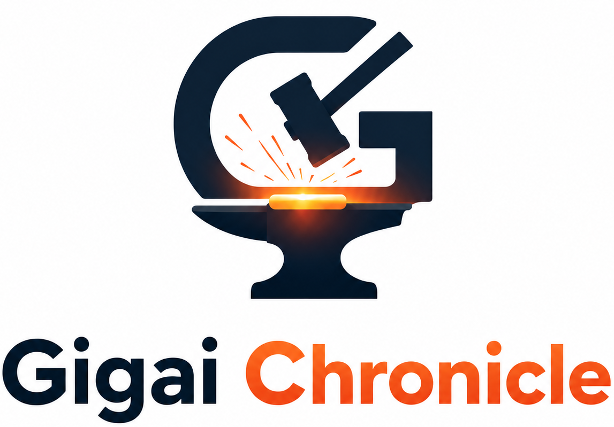

<p align="center">
  
</p>

# The Gigai Chronicle Guide

The complete guide: what Chronicle is, why it exists, how to install it, and how
to use every part of it. If you read one document, read this one.

- [What is Gigai Chronicle?](#what-is-gigai-chronicle)
- [Why you need it](#why-you-need-it)
- [How it works](#how-it-works)
- [Installation](#installation)
- [Your first 5 minutes](#your-first-5-minutes)
- [The core workflows](#the-core-workflows)
- [Command reference](#command-reference)
- [Privacy & trust](#privacy--trust)
- [Teams](#teams)
- [FAQ](#faq)

---

## What is Gigai Chronicle?

Git answers **what** changed. Gigai Chronicle answers **what was asked**.

As AI writes a growing share of your code, a second history is being created and
thrown away — the *intent* history. The prompt you typed, what the model
proposed, the tool it ran, what you accepted, what you rejected and why. Today
that lives in tool-specific log files or vanishes when you close the tab.

Chronicle keeps it: an **append-only, plain-text log of your AI-assisted
development journey**, stored **inside your git repository**, with tools to
capture, replay, and understand it. It's two pieces:

- **`chronicle`** — a CLI that captures the journey and answers questions about it.
- **A VS Code / Cursor / Windsurf extension** — that shows it in your editor.

No account. No server. No network. **It never calls a model.**

## Why you need it

Six concrete pains, from a solo paper-cut to a team-wide risk:

| Pain | Who | Chronicle's answer |
|---|---|---|
| "That prompt worked — where is it now?" | every AI user | the prompt library (`chronicle prompt`) |
| "What did the agent already try before the weekend?" | every AI user | `chronicle replay` |
| Reviewing an AI-heavy PR with no idea what was asked | teams | `chronicle why`, replay-in-review |
| "Which AI change introduced this regression?" | teams | `chronicle why`, `chronicle inspect` |
| "I prompted five times and my code is a mess" | every AI user | `chronicle restore` — go back to any prompt |
| "Our policy now requires a record of AI involvement" | regulated orgs | the in-repo journal + `chronicle doctor` |

The one-line pitch: **`git blame` tells you *you* wrote the line. Chronicle tells
you *what you asked for* — and can put the code back to the moment before you
asked.**

## How it works

```
Your AI tool ──hooks──▶ Event Engine ──▶ .chronicle/   ──▶ Replay ──▶ CLI / Editor
                        VALIDATE           (JSONL,           │
                        REDACT              plain text,      └─▶ why · restore · timeline
                        ENRICH              in your repo)
                        NORMALIZE
```

- **The store is a directory in your git repo** (`.chronicle/`). Files are the
  API; git is the transport. That single choice is why there's no infrastructure
  to run — your journey travels by `git clone`.
- **The Event Engine is the only way in.** Every captured moment passes through
  VALIDATE → REDACT → ENRICH → NORMALIZE, so **secrets are redacted before the
  first byte reaches disk**.
- **Checkpoints are git-native.** Every prompt snapshots your working tree into a
  hidden git ref (`refs/chronicle/ckpt/*`) — in your own object store, never
  touching HEAD, your branches, or your history. That's what powers `restore`.
- **The index is a disposable cache** (`.chronicle/.cache/`). Deleting it is
  always safe; it rebuilds from the log.

Full technical spec: [ARCHITECTURE.md](ARCHITECTURE.md).

## Installation

**Requires:** Node.js ≥ 20.19 and git.

### The CLI

Once published to npm:

```bash
npm install -g @gigaichronicle/cli
chronicle --help
```

From source (works today):

```bash
git clone https://github.com/cbsshekhawat18-lab/gigai-chronicle.git
cd gigai-chronicle
corepack pnpm install
corepack pnpm build
cd apps/cli && npm link    # exposes `chronicle`
```

### The editor extension (VS Code, Cursor, Windsurf)

- **VS Code:** search "Gigai Chronicle" in the Extensions view (VS Code Marketplace).
- **Cursor / Windsurf / VSCodium:** install from the Open VSX registry.
- **Any editor, manually:** download the `.vsix` from
  [Releases](https://github.com/cbsshekhawat18-lab/gigai-chronicle/releases) →
  Command Palette → *Extensions: Install from VSIX…*

## Your first 5 minutes

```bash
cd your-git-repo

chronicle init                        # create the .chronicle/ store (3 questions, all skippable)
chronicle hooks install claude-code   # capture live — merges into .claude/settings.json
```

That's the whole setup. Now **work normally** — every prompt is recorded, and
every prompt checkpoints your code so you can go back.

Already have history? Backfill it instantly:

```bash
chronicle import claude-code          # reads transcripts you already have on disk
```

Then look around:

```bash
chronicle timeline          # what happened
chronicle sessions          # who/what did the work, with model badges
chronicle why src/auth.ts   # what was ASKED that made this file
chronicle doctor            # prove it's all local and intact
```

## The core workflows

### "Why is this code like this?"

```bash
chronicle why src/auth.ts
```

Lists the prompts that shaped the file, newest first, with the churn each caused
and a one-key `restore` handoff. In the editor: right-click the file →
**Chronicle: Why is this file like this?**

> Honest limit: a turn's diff is everything that changed while that prompt was
> open — it reports *what happened during a prompt*, not a claim about what the
> model alone wrote. And because checkpoints are local (not pushed), `why` works
> on the machine that did the work; a fresh clone replays the story but can't
> attribute lines.

### Undo a bad AI detour

```bash
chronicle restore <event-id>          # from `chronicle why` or the timeline
```

Puts your working tree back to how it was at that prompt. **Always
safety-checkpointed first** — nothing is ever lost, and the restore is itself
recorded.

### Keep a prompt that worked

```bash
chronicle prompt save auth-review --from-last     # promote the one you just typed
chronicle prompt list
chronicle prompt diff auth-review 1 2             # plain-text diff between versions
```

Prompts are curated, versioned Markdown in `.chronicle/prompts/`, synced by git —
commit one and your whole team gets it.

### Replay a session

```bash
chronicle replay <session-id>
```

Step through prompts, responses, tool runs, and commits interleaved in order.
Code review with the intent attached.

## Command reference

| Command | Purpose |
|---|---|
| `chronicle init` | Initialize the store (prints its complete footprint) |
| `chronicle why <file>` | What was **asked** that made this file |
| `chronicle restore <evt>` | ⏪ Code time-travel to any prompt |
| `chronicle replay <session>` | Step through a session |
| `chronicle timeline` | The journey, filtered (`--since --until --branch --type…`) |
| `chronicle sessions` | Sessions with provider/model badges |
| `chronicle prompt save\|list\|show\|versions\|diff` | Version control for prompts |
| `chronicle inspect <id\|sha>` | The `git show` of Chronicle |
| `chronicle session privatize\|promote <id>` | Move a session off the shared record, or back |
| `chronicle import <provider>` | Backfill from existing transcripts |
| `chronicle hooks install\|uninstall <provider>` | Live capture (merges, never clobbers) |
| `chronicle doctor` | Integrity, secret audit, zero-egress proof |
| `chronicle log <message>` | Manual capture — the universal floor |

`--json` on every command (`{"apiVersion":1,…}`). Exit codes: `0` ok · `1`
failure · `2` usage · `3` not a Chronicle project.

## Privacy & trust

Chronicle is built for people who cannot send their prompts to a vendor.

- **Zero network by default** — `chronicle doctor` prints a proof on demand:
  `egress zero-network (no endpoints configured, telemetry: none)`.
- **Never calls a model.** Never phones home. Never stores your file contents.
- **Secrets are redacted at capture**, irreversibly, before anything is written —
  including your own patterns (`capture.redaction.customPatterns`).
- **`chronicle init --metadata-only`** records shapes and timings with **no
  prompt text** — for repositories where the words themselves are sensitive.
- **Sessions can be born private** (`--private-sessions`) or moved off the shared
  record at any time (`chronicle session privatize`).
- **Never scores developers.** No leaderboards, no per-author metrics. Ever.

> ⚠️ **Understand the default:** your journey is **shared** — it commits and
> pushes with your repo. That's the point (a teammate clones and inherits the
> story), but it means your prompts are exactly as public as your repository.
> Read the full [privacy model](privacy.md) before pushing anything sensitive.

## Teams

A teammate clones your repo and immediately has the journey — no setup, no
account. `replay` and the prompt library travel with the repo; review saved
prompts in a PR like any other file. (`why` and `restore` are local-only —
checkpoints aren't pushed — so a fresh clone replays the story but can't
attribute lines.)

## FAQ

**Does Chronicle send my prompts anywhere?** No. Zero network by default; it
never calls a model or phones home. `chronicle doctor` proves it.

**Does it change my git history?** No — except two sanctioned, opt-in/opt-out
writes it's explicit about: the `Chronicle-Session:` commit trailer (opt-in) and
shadow code checkpoints (opt-out). It never rewrites your commits.

**Which AI tools does it support?** Claude Code today. Codex, Gemini, and Cursor
are on the roadmap — see [PROVIDERS.md](PROVIDERS.md).

**What if I use a tool it doesn't support yet?** Capture is per-provider, so that
tool's sessions won't be recorded until a provider lands. Everything else (git
correlation, manual `chronicle log`) still works.

**Is it really free?** Yes — MIT for the code, CC-BY for the spec. No paid tier
is required for anything in this guide.

---

Built by [Gigai](https://github.com/cbsshekhawat18-lab). Free and open source —
[source & spec](https://github.com/cbsshekhawat18-lab/gigai-chronicle).
