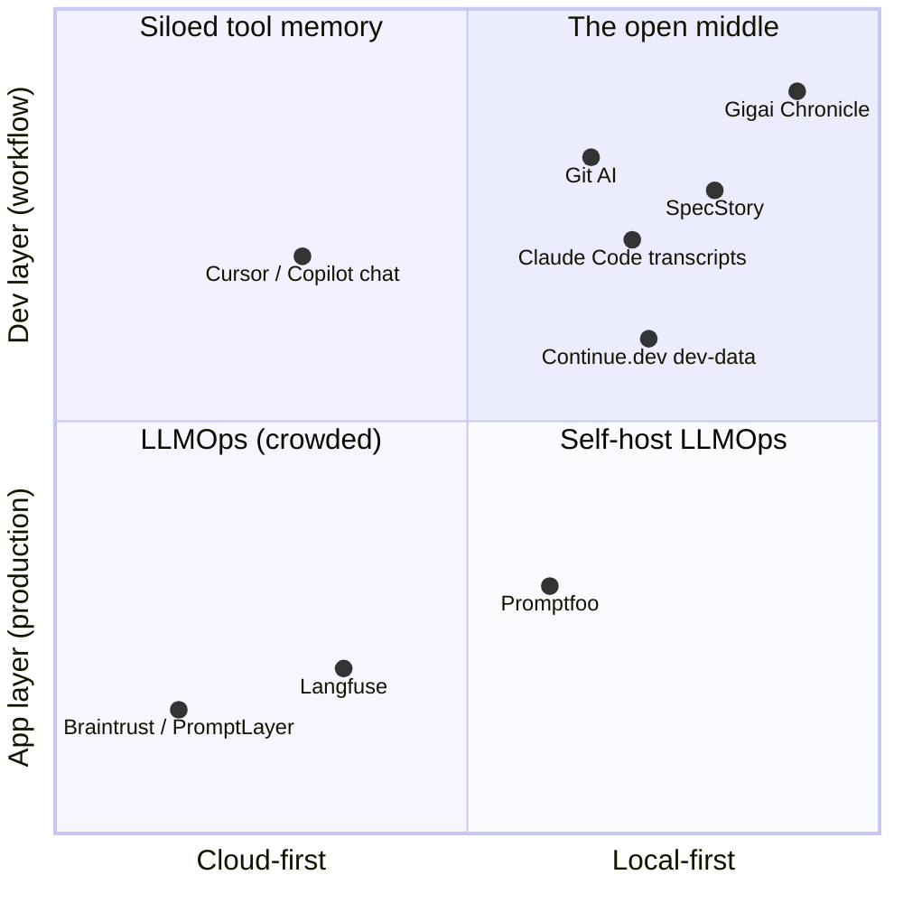

# Gigai Chronicle — Phase 0: Product Validation & Production Architecture

> Status: `APPROVED 2026-07-14` · Companion: [ARCHITECTURE.md](ARCHITECTURE.md) (v2 technical spec)
> Date: 2026-07-14 · Author role: Principal Architect / Product Architect / OSS Maintainer
>
> **⟲ v2 REVISION NOTE (2026-07-14, post-approval):** the architecture was
> revised before implementation. Where this document conflicts with the v2
> set, **v2 wins**: [ARCHITECTURE.md](ARCHITECTURE.md) (Event Engine pipeline,
> ChronicleEvent model, Replay Engine, identity model, **`.chronicle/`** dir —
> renamed from `.chronicle/` — and `Chronicle-Session:` trailer),
> [ARCHITECTURE-REVIEW.md](ARCHITECTURE-REVIEW.md) (MVP cuts),
> [SPEC-ROADMAP.md](SPEC-ROADMAP.md), [PROVIDERS.md](PROVIDERS.md),
> [HOMEPAGE.md](HOMEPAGE.md), [VISION.md](VISION.md). Sections §3 and §19
> below were updated in place; the rest stands as the approved validation
> record ("adapter" reads as "provider" throughout).

This document challenges every assumption in the vision, validates (and where
necessary corrects) the product thesis, and locks the decisions a senior team
needs to build without guessing. Where Phase 0 analysis **changed** a decision
from ARCHITECTURE.md v1, the change is marked `⟲ AMENDED` and collected in
[§21](#21-phase-0-verdict--amendments).

---

## Contents

1. [Product Validation](#1-product-validation)
2. [Competitive Analysis](#2-competitive-analysis)
3. [Product Positioning](#3-product-positioning)
4. [Core Principles](#4-core-principles)
5. [Product Boundaries](#5-product-boundaries)
6. [User Personas](#6-user-personas)
7. [User Journeys](#7-user-journeys)
8. [Information Architecture](#8-information-architecture)
9. [.chronicle Specification & Storage Strategy](#9-chronicle-specification--storage-strategy)
10. [Extension Architecture](#10-extension-architecture)
11. [CLI Architecture](#11-cli-architecture)
12. [Plugin Architecture](#12-plugin-architecture)
13. [Security Model](#13-security-model)
14. [Privacy Model](#14-privacy-model)
15. [Performance Strategy](#15-performance-strategy)
16. [Open Source Strategy](#16-open-source-strategy)
17. [Business Model](#17-business-model)
18. [Risks](#18-risks)
19. [MVP Roadmap](#19-mvp-roadmap)
20. [Long-Term Vision](#20-long-term-vision)
21. [Phase 0 Verdict & Amendments](#21-phase-0-verdict--amendments)

---

## 1. Product Validation

### 1.1 The problem, stated precisely

AI-assisted development produces **two histories**. Git records the *artifact
history* — what the code became. The *intent history* — what was asked, what
the model proposed, what was rejected and why, what constraints shaped the
result — is scattered across tool-specific log files or discarded entirely.
As AI writes a growing share of code, a growing share of the **why** has no
durable, searchable, shareable record.

This decomposes into six concrete, independently testable pains:

| # | Pain | Who feels it | Frequency | Intensity |
|---|---|---|---|---|
| P1 | **Lost prompt** — "that prompt worked; where is it now?" | Every heavy AI user | Daily | Paper cut, compounds |
| P2 | **Lost context** — "what did the agent already try before the weekend?" | Every heavy AI user | Weekly | Moderate, recurring |
| P3 | **Unreviewable provenance** — reviewing AI-heavy PRs with no access to intent | Teams | Every PR | High and growing |
| P4 | **Incident forensics** — "which AI change introduced this regression?" | Teams | Episodic | Acute when it hits |
| P5 | **Team blindness** — no view of how AI is used, what works, what's risky | Leads, orgs | Continuous | Dull but strategic |
| P6 | **Disclosure/compliance** — org policies starting to require records of AI involvement | Enterprises, regulated | Growing | Externally imposed |

### 1.2 Is this a real problem? Evidence

**Yes — and since 2025 the market has started proving it for us:**

1. **Independent entrants attacking slices of it.** SpecStory (auto-saves
   Cursor/Claude Code/Codex/Gemini sessions to markdown in-repo), Git AI (a
   git extension attributing every AI-generated line to agent/model/prompt,
   with team analytics), and ai-trailers (prompts embedded as git commit
   trailers) all shipped and found users. Three unrelated teams building
   partial solutions is demand evidence, not coincidence.
2. **Tool vendors keep adding memory.** Claude Code persists transcripts and
   added `--resume`/hooks; Codex and Gemini CLI persist session rollouts;
   Continue.dev writes local "development data" to `.continue/dev_data`.
   Vendors acknowledge session data has value — but each stores it in a
   proprietary silo scoped to their own tool.
3. **Observable hoarding behavior.** Developers keep prompt collections in
   Notes, gists, and README snippets — manual, lossy versions of P1.
4. **Review pain is now a named industry problem.** Reviewing high-volume
   AI-generated changes without intent context is a widely discussed failure
   mode of agentic development.

**Honest counterweight (the vitamin problem).** For a solo developer on a
normal Tuesday, P1/P2 sting for seconds, not hours. Nobody wakes up
desperate for a timeline. The pain is *cumulative and episodic*, which means:

> **Adoption-critical consequence:** Gigai Chronicle must cost effectively
> *nothing* to adopt — passive capture, no workflow change, no ceremony — and
> must deliver its first "aha" within five minutes via **backfill import** of
> the user's existing transcript history. A vitamin only gets swallowed if
> it's free and already on the table. The episodic pains (P3–P6) then convert
> retention into advocacy the first time a timeline answers a hard question.

### 1.3 Why has nobody solved it completely?

1. **Capture is fragmented and API-less.** Every AI tool logs differently;
   none expose stable capture APIs (Claude Code's hooks are the exception).
   Solving capture *across* tools is unglamorous integration work that breaks
   with every tool release — exactly the work VC-scale companies avoid.
2. **The money pointed elsewhere.** The LLM-observability wave (Langfuse,
   Braintrust, PromptLayer, Humanloop) chased *production* traces of LLM
   *applications* — the app layer, where enterprise budgets were. The
   dev-workflow layer has no per-token bill to observe, so it was ignored.
3. **The data barely existed before 2024–25.** Agentic coding at volume is
   new. There was no journey to record until recently.
4. **Vendor incentives forbid neutrality.** Cursor will never build
   first-class memory for Claude Code sessions and vice versa. The neutral
   layer must be built by a party whose business model is neutrality —
   realistically, open source.
5. **Cloud-first economics fail here.** Developers will not stream their
   prompts to a startup's server. Humanloop's story is the cautionary tale:
   acquired by Anthropic in August 2025 as a talent deal, platform shut down
   that September, customers migrating under deadline. A journey record must
   outlive any company — which demands local-first, plain-text, open-spec.

### 1.4 Validation plan (falsifiable)

Ship the MVP (§19), then measure for 90 days:

| Signal | Target | Kill/pivot threshold |
|---|---|---|
| Time-to-first-aha (install → sees own backfilled timeline) | < 5 min | > 15 min → onboarding is broken |
| Week-4 capture retention (still recording) | > 25% of installs | < 10% → vitamin thesis fails, pivot to team-first |
| Timeline opened per active user | ≥ 1×/week | Rarely → capture-only tool; cut UI investment |
| Prompt reuse (copy/re-run from history) | ≥ 10% of actives | — (feature signal for prompt library priority) |
| Qualitative | 20 recorded user interviews | Users can't articulate value in own words → reposition |

Phase 0 verdict on validation: **conditionally real** — real enough to build,
conditioned on zero-friction capture and a five-minute first-value path. The
2026 competitive activity says the window is open **and closing**.

---

## 2. Competitive Analysis

### 2.1 The two clusters that miss the middle

**Cluster A — LLM observability / PromptOps (app layer, cloud-first):**

| Product | What it solves | What it doesn't | Opportunity for Gigai Chronicle |
|---|---|---|---|
| **Langfuse** | OSS tracing/evals/prompt-mgmt for LLM *applications in production*; self-hostable | Knows nothing of the dev workflow, IDEs, or git; instruments your app, not your coding | Different layer entirely; borrow its OSS+cloud open-core playbook |
| **Promptfoo** | Config-driven prompt eval/testing/red-teaming CLI | Evaluates prompts as isolated artifacts; no capture, no journey, no git link | **Interop, not war:** a Phase-3 plugin can use promptfoo as a benchmark runner instead of rebuilding one |
| **Humanloop** † | Enterprise prompt mgmt/evals (Duolingo, Gusto, Vanta) | Shut down Sept 2025 after Anthropic acqui-hire; no IP acquired | The cautionary tale that *sells* local-first: your journey must survive any vendor's death |
| **PromptLayer** | API-middleware prompt logging/registry | Only sees traffic proxied through it; production-focused; cloud | Dev-time vs run-time — no overlap |
| **Braintrust** | Evals platform for LLM product teams | Same app-layer scope; cloud-first | Same non-overlap |

**Cluster B — AI coding tools (dev layer, but siloed):**

| Product | What it solves | What it doesn't | Opportunity |
|---|---|---|---|
| **Claude Code** | Best-in-class agentic coding; persists transcripts, `--resume`, **hooks API** | Own-tool memory only; JSONL transcripts unsearchable/unlinked to git; no visualization | Hooks = our tier-1 capture surface; their transcripts = our backfill |
| **Cursor / Windsurf** | AI-native IDE; local chat state | Proprietary chat store, no timeline, no cross-tool view, no stable access API | Their users are our earliest adopters; capture is fragile (§18 R2) |
| **Codex CLI / Gemini CLI** | Terminal agents with session rollout logs | Logs are exhaust, not a product | Tier-2 adapters + backfill |
| **GitHub Copilot** | Completion/chat at massive scale | Ephemeral chat; no journey concept | Validates scale of AI-assisted work; possible future adapter |
| **Continue.dev** | OSS assistant (VS Code/JetBrains/Neovim); logs local "dev data" to `.continue/dev_data` | Data serves *their* assistant/fine-tuning loop, tied to using Continue as the assistant | Philosophical neighbor; proves devs accept local dev-data capture |
| **GitLens** | Made git history *legible* in-editor; 30M+ installs | No AI awareness | The role model: category (companion extension), UX bar, and GitKraken's open-core business model |

### 2.2 Direct competitors (the middle is no longer empty)

| Product | What it solves | Gaps Gigai Chronicle exploits |
|---|---|---|
| **SpecStory** (closest) | Auto-saves AI sessions (Cursor, Claude Code, Codex, Gemini CLI, more) to `.specstory/history/` markdown; local, private, git-friendly; VS Code ext + CLI wrapper | Flat transcripts, not a data model: no event structure, no git *correlation* (prompt↔commit), no timeline UI, no knowledge extraction, no benchmarks, no open spec others can implement, no plugin system. It saves the journey; it doesn't *understand* it |
| **Git AI** (usegitai.com, OSS git extension) | Attributes AI-generated lines to agent/model/prompt; "prompt to production" trace; team analytics (% AI per PR, token spend) | Attribution-first, analytics-flavored (leaderboard risk — see §5 boundary 10); no session/journey model, no prompt library, no knowledge layer, no IDE-native timeline. Strategically the most serious competitor for teams |
| **ai-trailers** | Embeds prompts as git commit trailers across Claude Code/Gemini/Codex/Kiro | A mechanism, not a product — validates our opt-in trailer design; we should **read/interop with their trailer format** |
| **1DevTool Prompt History** | Captures prompts across agents into a searchable personal library | Prompt-library slice only; no journey, no git anchoring |

### 2.3 Positioning map & synthesis



**Synthesis.** Nobody yet owns *cross-tool capture + git correlation +
in-editor visualization + knowledge/benchmark intelligence, on an open spec*.
SpecStory proves capture demand but stops at transcripts. Git AI proves team
demand but starts at attribution analytics. The defensible position is the
**data model and open spec in the middle** — the layer both of them (and the
tool vendors) would have to reinvent. Speed matters: this gap is ~12–18
months from being closed by someone.

**Interop plays (cheap, high-leverage):** import adapters for SpecStory
markdown and Claude/Codex/Gemini native logs (adoption on day one); read
ai-trailers' commit-trailer format; map our event taxonomy to OpenTelemetry
GenAI semantic conventions so enterprise observability pipelines can consume
Chronicle events without custom glue; use promptfoo as a pluggable benchmark
runner in Phase 3.

*Sources: [TechCrunch — Anthropic nabs Humanloop team](https://techcrunch.com/2025/08/13/anthropic-nabs-humanloop-team-as-competition-for-enterprise-ai-talent-heats-up/), [SpecStory docs](https://docs.specstory.com/quickstart), [SpecStory CLI](https://specstory.com/claude-code), [Git AI](https://usegitai.com/), [git-ai on GitHub](https://github.com/git-ai-project/git-ai), [ai-trailers](https://github.com/EslaMx7/ai-trailers), [Continue.dev](https://github.com/continuedev/continue).*

---

## 3. Product Positioning

`⟲ REWRITTEN in v2` — this section was replaced during the 2026-07-14
architecture revision (item 9 of the revision directive).

**The product promise (canonical, everywhere):**

> **Build software with AI. Never lose the journey.**

**Category: a *Developer Tool* in the *Git companion* family. Message:
"AI Development History" — with Replay as the hero capability.**

The elevator sentence:

> **GitLens shows you your Git history. Gigai Chronicle shows you your AI
> development history — linked to your commits, and replayable.**

**Banned vocabulary** (v2, hard rule for all docs/marketing/UI copy):
Chronicle is never described as a *Prompt Manager*, *Prompt Versioning*, or
*PromptOps*. Those words bind us to Cluster A (production prompt management,
§2.1), describe a minor projection as if it were the product, and invite
comparison with tools we don't compete with. Also still banned: any promise
tied to a single vendor's tool ("never lose another Claude Code session") —
Claude Code is the first provider, never the identity.

**The three candidate positions, compared:**

| Position | What it claims | Strengths | Weaknesses | Verdict |
|---|---|---|---|---|
| **AI Development History** | "Your AI work now has a durable, searchable, git-linked record" | Instantly understood via the git-log/GitLens analogy; truthful on day 1 (capture + backfill deliver it at minute 5); names the *category gap* — the missing second history (§1.1); calm, trust-compatible wording | Sounds passive if left alone — "history" alone undersells replay | ✅ **The category — lead with it** |
| **AI Development Replay** | "Step through any past session — conversation, tools, files, commits" | Names the differentiator nobody else has (SpecStory stores, Git AI attributes — neither *replays*); demo-able in one GIF; concrete verb | Too narrow to be the whole identity: correlation, search, digests, knowledge don't fit under "replay"; unfamiliar as a category word — needs the history frame to make sense | ✅ **The hero capability inside the category** |
| **AI Development Intelligence** | "Understanding *about* AI-assisted development" | The right year-3 umbrella once knowledge/benchmarks/analytics exist (v1's choice) | Overpromises at MVP (intelligence features are Phase 2–3 — violates truth-in-positioning); "intelligence" pattern-matches to manager dashboards and triggers the surveillance antibody (§5.10, R6) | ◐ **The Phase 2+ umbrella — grows into it, doesn't launch on it** |

**Recommendation:** position as **AI Development History** (category), with
**Replay** as the hero capability in every demo and the first screenshot, and
graduate the messaging to **AI Development Intelligence** only when the
knowledge/benchmark layers ship and make it true. History is what developers
recognize as missing; replay is why Chronicle wins; intelligence is what it
becomes.

Positioning discipline: it **installs like GitLens** (individual pull, no
approval needed, free forever locally) and — years later — **sells like
Sentry** (the team/org coordination layer is the product, never the local
capability). Homepage execution of this positioning: [HOMEPAGE.md](HOMEPAGE.md).

---

## 4. Core Principles

Fifteen principles; each exists to prevent a specific failure mode.

1. **Local-first.** Everything works with zero servers — because a journey
   record that dies with a vendor (Humanloop) is worse than no record.
2. **Privacy by default.** Zero network egress until explicitly configured;
   provable via `chronicle doctor` and a CI network-denial harness — because
   trust is our only currency and it's non-renewable.
3. **Git-native.** Anchor to commits/branches/repos; sync *through* git —
   because git is the one tool every target user already trusts.
4. **Open spec first.** The `.chronicle/` format is the product; our tools
   are reference implementations — because formats outlive programs (SQLite's
   and git's own lesson).
5. **Tool-neutral (the Switzerland principle).** Equal citizenship for
   Claude, Codex, Gemini, Cursor, whatever comes next — because neutrality is
   the one thing no AI vendor can copy.
6. **Invisible until needed.** Passive capture, no ceremony, no popups, no
   "gamification" — because any workflow tax kills a vitamin product (§1.2).
7. **Value alone in week one.** A solo dev must profit before any teammate
   joins — because bottom-up tools die waiting for team adoption.
8. **Honest data.** Confidence-scored correlations, recorded capture gaps,
   inferred links visibly different from exact ones — because one silently
   wrong "this prompt caused this commit" destroys all credibility.
9. **Never block the developer.** Capture failures degrade silently to lower
   tiers; Chronicle crashing must never break coding, committing, or the AI tool —
   because we are a passenger, not a driver.
10. **Plain text forever.** Markdown/JSON/JSONL/YAML; readable with `cat`,
    diffable, greppable — because the 10-year test (§20) demands it.
11. **Degrade gracefully.** Hooks → log parsing → pty wrap → manual; every
    tier useful — because we depend on surfaces we don't control.
12. **Boring technology.** Node LTS, SQLite, system git, stable VS Code APIs —
    because our innovation budget belongs to the data model and capture.
13. **Extensible by contract.** Every integration (including our own) goes
    through the plugin interface — because eating our own dogfood keeps the
    API honest before it's public.
14. **Fast is a feature.** Performance budgets in CI (§15) — because "it
    slowed my editor" is the #1 extension uninstall reason.
15. **Own your data, always.** Full-fidelity `chronicle export`, no import
    asymmetry, delete = delete — because exit rights are what make entry safe.

---

## 5. Product Boundaries

What Gigai Chronicle **will not do** — each boundary blocks a specific creep vector:

1. **Will not replace or wrap Git.** We read git; we never rewrite history.
   (Sole opt-in exception: a `prepare-commit-msg` trailer.)
2. **Will not replace GitHub/GitLab.** Integrations decorate PRs; they never
   host code.
3. **Will not generate or modify code.** Ever. Not "not yet" — ever. The
   moment we write code we compete with the tools we must stay neutral toward.
4. **Core will never call an LLM.** `⟲ AMENDED` (refined from v1's absolute):
   the *core* requires no model and sends nothing anywhere. Optional,
   clearly-labeled **plugins** (e.g., Phase-2 semantic summarization) may use
   the *user's own* keys/local models — off by default, marked in output as
   model-derived. Default extractors are rule-based.
5. **Will not become a chatbot.** No chat panel, no "ask your history"
   text box in core. (Query API exists; conversational UI is someone else's
   plugin.)
6. **Will not store repositories or file contents server-side.** The cloud
   schema *rejects* file contents (enforced, not promised).
7. **Will not require accounts, sign-ins, or cloud for any local feature.**
8. **Will not inject context into your AI conversations.** We observe the
   journey; we never alter it. (That's Continue.dev's lane.)
9. **Will not auto-commit, auto-push, or auto-configure git hooks.** Every
   git-touching behavior is individually opt-in.
10. **Will not rank, score, or leaderboard individual developers.** Team
    analytics aggregate by project and practice, never by person-as-metric —
    because the instant Chronicle becomes surveillance, developers (correctly)
    kill it. This is a trust boundary Git AI's "% AI per developer" analytics
    flirt with; we take the other side on purpose.
11. **Will not phone home.** No telemetry, crash reporting, or update pings
    without explicit opt-in.
12. **Will not invent binary or proprietary formats.** If `cat` can't read
    it, we don't write it (SQLite cache exempt: derived, disposable, local).

---

## 6. User Personas

**1. Solo Developer — "Mira", senior full-stack, ships side projects with Claude Code.**
Goals: velocity without losing the thread across projects. Workflow: VS Code +
Claude Code daily, git discipline moderate. Problems: P1/P2 — re-derives lost
prompts, forgets what the agent tried. Why Chronicle: backfilled timeline of the
last month appears at install; session digests answer "where was I?" Daily
usage: passive capture; opens timeline Monday mornings and after long agent
runs; copies past prompts weekly.

**2. Startup Founder / Tech Lead — "Dev", CTO of a 6-person team, AI-heavy velocity culture.**
Goals: speed *and* the ability to answer "why is the code like this?" later.
Problems: P3/P4/P5 — PRs too large to review deeply, incidents hard to trace,
zero view of team AI practice. Why Chronicle: session digests attached to PRs;
incident forensics via commit↔session links; committed `.chronicle/` means
the journey onboards with the clone. Daily: reads digests in review; timeline
during incidents; monthly `chronicle analyze` for practice patterns.

**3. Enterprise Team Lead — "Priya", staff engineer in a regulated org (fintech).**
Goals: adopt AI tooling within compliance constraints; produce AI-involvement
records. Problems: P6 above all; also vendor-neutrality mandates. Why Chronicle:
local-first satisfies security review; metadata-only redaction mode; audit
trail exportable; no per-developer surveillance (makes works councils and
engineers allies, not enemies). Daily: mostly consumes reports; relies on
`chronicle doctor` attestations. Future cloud/SSO buyer (§17).

**4. Open Source Maintainer — "Tomás", maintains a popular library, drowning in AI-generated PRs.**
Goals: judge external contributions; document his own AI-assisted decisions
publicly. Problems: P3 from the *receiving* end; wants contributors to
disclose AI provenance. Why Chronicle: asks contributors to include session
digests; his own repo's `.chronicle/` doubles as public decision record.
Usage: episodic, review-time; a distribution channel more than a power user.

**5. AI Engineer — "Sana", builds LLM features, lives in prompts across four tools.**
Goals: know which prompt/model variants actually worked, across Claude Code,
Codex CLI, and scratch experiments. Problems: P1 acutely, plus model-upgrade
regressions (Phase 3 pains today). Why Chronicle: cross-tool prompt history with
versioning; later benchmarks/regressions on *her* real prompts. Daily: heaviest
power user — prompt library, `chronicle inspect`, diffing prompt versions.

**6. Freelancer — "Alex", contract developer, 3–4 client projects in parallel.**
Goals: context-switch cheaply; *prove* work and decisions to clients.
Problems: P2 multiplied by client count; disputes over "why did you build it
this way?" Why Chronicle: per-repo journeys isolate clients; `chronicle export`
produces a professional decision/AI-usage report at handoff — a deliverable
competitors don't give him. Weekly: export at invoice time; timeline at every
context switch.

---

## 7. User Journeys

**J1 — First run (the five-minute aha).**
Install extension → activity-bar icon appears, nothing else (no popup) → opens
sidebar → "Initialize Gigai Chronicle in this repo" → `chronicle init` runs: detects
Claude Code transcripts + git history → offers backfill import → **timeline
renders the user's own last month** (sessions aligned against commits) →
first insight ("that's the session where I rewrote auth") in < 5 minutes,
before writing any new prompt. *Design consequence: backfill is P0, not a
nice-to-have (§19).*

**J2 — Daily solo loop (passive).**
Open VS Code → start Claude Code → hooks stream events (redacted at capture)
→ accept changes → commit (opt-in trailer stamps `Chronicle-Session:`) → push.
Chronicle writes the JSONL log, updates the index, refreshes the timeline, and
generates the session digest at session end. **Developer-perceived overhead:
zero.** No step above required the developer to do anything for Chronicle.

**J3 — Incident forensics.**
Prod regression traced to commit `9fc1b2a` → `chronicle inspect 9fc1b2a` (or
click the commit in the timeline) → linked session with confidence `exact`
(trailer) → digest shows the prompt asked for a "simplification" that dropped
a null-check; the model even flagged it in the response, unnoticed → fix
follows in minutes; retro gets a factual timeline instead of archaeology.

**J4 — PR review with intent.**
Reviewer opens an AI-heavy PR → `.chronicle/sessions/…md` digest is part of
the diff (collapsed as generated by `.gitattributes`, expandable) → reads
intent, constraints considered, alternatives rejected → reviews the *code*
against the *stated intent* instead of reverse-engineering both.

**J5 — Model-upgrade regression (Phase 3).**
New model version announced → `chronicle test` replays the team's prompt
regression suite (assertions on structure/content, runner pluggable, e.g.
promptfoo) → two prompts regress → team fixes them *before* switching the
default model. The suite came from real captured prompts, not synthetic evals.

**J6 — Onboarding a teammate.**
New hire clones repo → `.chronicle/` arrives with it (git *is* the sync) →
installs extension → timeline + decision records + prompt library render
immediately → reads the architecture timeline: not just *what* the system is,
but *the journey of decisions* that made it so.

**J7 — Freelancer handoff.**
Project ends → `chronicle export --report handoff` → a Markdown dossier:
decision log, AI-usage disclosure, session summaries, prompt library → client
receives professional provenance documentation; Alex gets paid faster.

---

## 8. Information Architecture

Five strict layers; data flows downward only through contracts:

```
CAPTURE      adapters (hooks / log-tail / pty / manual) → normalize to events
   ↓             one schema, redaction BEFORE first write
TRUTH        append-only JSONL event log in .chronicle/sessions/
   ↓             immutable, ULID-keyed, single-writer files, git-synced
INDEX        SQLite (.cache/) — derived, disposable, rebuildable
   ↓             queries, FTS search, correlation edges
INTELLIGENCE extractors & correlators — projections, never new truth
   ↓             digests, timelines, knowledge, links (confidence-scored)
SURFACES     VS Code webview/trees · CLI · (Phase 4) cloud dashboards
```

Canonical vs derived, the load-bearing distinction: **Sessions and Events are
canonical. Prompts-library, knowledge files, and milestones are canonical but
human-curated (their edits are recorded as events). Everything else — the
timeline, digests, links, analytics — is a projection** that can be deleted
and regenerated. This single rule is what makes sync conflict-free, the index
disposable, and the format stable across a decade.

Full ChronicleEvent envelope/taxonomy: [ARCHITECTURE.md §5](ARCHITECTURE.md#5-the-chronicleevent-model);
the pipeline this layering became in v2: [ARCHITECTURE.md §3](ARCHITECTURE.md#3-system-overview-the-chronicle-pipeline)
(with the Replay Engine inserted between store and projections).

---

## 9. .chronicle Specification & Storage Strategy

`⟲ RENAMED in v2` — the directory was `.gigaichronicle/` when this document
was approved; v2 re-opened the naming decision and settled on `.chronicle/`
([ARCHITECTURE.md §7.1](ARCHITECTURE.md#7-on-disk-format-the-chronicle-spec)).

### 9.1 Directory specification (why every entry exists)

```
.chronicle/
├── config.json        # The only shared-mutable file. Small, rarely edited, JSON-
│                      # Schema-validated. JSON not YAML: exact parsing, no indent wars.
├── .gitignore         # Auto-generated; excludes .cache/ and .local/. Exists so the
│                      # committed tree stays 100% plain text and machine-local state never leaks.
├── .cache/index.db    # SQLite index + FTS5. Derived. Deleting it is always safe
│                      # (chronicle doctor --reindex). Never committed — indexes don't merge.
├── .local/            # Machine-private: adapter cursors, machine ULID, sync outbox,
│   └── private/       # …and PRIVATE SESSIONS (⟲ AMENDED §21): sessions the user keeps
│                      # off the shared record until explicitly promoted.
├── prompts/           # Curated prompt library. One dir per prompt: prompt.md (current)
│                      # + versions/v*.md (immutable). Markdown+frontmatter: humans read
│                      # and edit prompts; version diff = text diff.
├── sessions/YYYY/MM/  # THE TRUTH. ses_<ulid>.jsonl event streams (append-only,
│                      # single-writer → structurally conflict-free) + ses_<ulid>.md
│                      # generated human digests (what teammates actually read in PRs).
│                      # Month sharding keeps directories listable at year scale.
├── timeline/          # Human-readable projections: monthly digests (generated,
│                      # regenerable) + milestones.yaml (hand-curated: releases, pivots).
│                      # Exists because "git log for the AI journey" should be readable
│                      # on GitHub with no tooling installed.
├── knowledge/         # Phase 2. decisions/ (MADR-style ADRs), requirements/, todos/.
│                      # One entity per file → merge-safe, individually linkable.
├── benchmarks/        # Phase 3 (⟲ AMENDED: renamed from benchmark/). suites/*.yaml
│                      # (declarative specs — YAML because humans author them) +
│                      # runs/YYYY/MM/*.json (results — JSON because machines write them).
├── tests/regressions/ # Phase 3. Prompt regression specs (YAML). Separate from
│                      # benchmarks: tests assert (pass/fail), benchmarks measure.
└── reports/           # chronicle export output. Committed or not — user's choice.
```

Plus `chronicle init` **appends `.gitattributes` entries** (`⟲ AMENDED`):
`.chronicle/sessions/** linguist-generated=true` etc., so generated files
collapse in GitHub/GitLab PR diffs — directly neutralizing the "repo
pollution" uninstall trigger (§18 R5).

### 9.2 Storage strategy — the honest comparison

| Medium | Strengths | Weaknesses | Verdict |
|---|---|---|---|
| **Markdown** | Human-readable, git-diffable, renders on GitHub, survives everything | Unqueryable at scale, schema-less | ✅ For everything humans read/edit: digests, prompts, knowledge, reports |
| **JSON / JSONL** | Exact, schema-validatable; JSONL appends O(1) and diffs line-wise | Less pleasant to read raw | ✅ JSONL for the event log (truth); JSON for machine-written results & config |
| **YAML** | Pleasant to hand-author, comments allowed | Whitespace fragility, parser quirks (Norway problem) | ✅ Only for human-*authored* specs: suites, milestones, regression tests. Never machine-written |
| **SQLite** | Fast queries, FTS5, WAL concurrency | Binary — un-diffable, un-mergeable, corruptible | ✅ Derived index only, gitignored, disposable. ❌ Never as truth |
| **Git notes** | Attaches metadata to commits without touching the tree | Not pushed/fetched by default, invisible in most UIs, conflict-prone, weak tooling, hosting support poor | ❌ Rejected as storage. ◐ Possible future *optional export* target for commit annotations |
| **Git metadata (trailers)** | Travels inside commits forever, host-rendered, greppable | Tiny capacity; write-time only; pollutes messages if verbose | ✅ Exactly one use: opt-in `Chronicle-Session: <id>` trailer for exact correlation (interop with ai-trailers' convention) |

**Recommendation (locked): the hybrid.** JSONL truth + Markdown for humans +
YAML for hand-authored specs + SQLite as disposable index + one git trailer.
Every medium does the one job it's best at; no medium is trusted outside its
lane. Rationale details: [ARCHITECTURE.md §7–8](ARCHITECTURE.md#7-on-disk-format-the-chronicle-spec)
(v2 also re-opened and settled the directory *name* itself — §7.1 there).

---

## 10. Extension Architecture

(Full spec: [ARCHITECTURE.md §15](ARCHITECTURE.md#15-vs-code--cursor--windsurf-extension). One codebase serves VS Code, Cursor, Windsurf via Marketplace + Open VSX. `⟲ v2:` MVP surface trimmed to one tree + one webview; the webview renders Replay Engine frames, never raw provider data.)

**Lifecycle** — four boot phases against a <50 ms activation budget:
A) synchronous: register commands, tree providers (empty-state), status-bar
item — nothing else; B) async: open core engine per workspace folder, schema
check, index catch-up; C) async: start watchers; D) idle-priority: backfill
reconciliation and digest generation. Activation events are narrow
(`workspaceContains:.chronicle/config.json`, explicit commands/views) —
never `*`. Deactivation flushes appends within a 2 s budget; every disposable
lives in `context.subscriptions`.

**Event listeners & watching** — three watcher families, all debounced and
coalesced: git (`.git/HEAD`, refs, index mtime → 200 ms debounce → plumbing
reads via system git), workspace files (only for `file.changed` batching
during active sessions, 500 ms), and `.chronicle/` curated files (re-index
on human edits). Adapter hooks (Claude Code) push events; watchers never poll
on timers.

**Sidebar** — native TreeViews (Projects, Prompts, Knowledge, Tests,
Benchmarks) for theme-native look, keyboard nav, and lazy `getChildren`
performance; exactly **one webview** (Timeline), loaded on first reveal,
CSP-locked, themed via `--vscode-*` variables. Monaco is not bundled — diffs
and prompt bodies open as native (virtual) documents via `vscode.diff`.

**Commands** — thin wrappers over the same core SDK the CLI uses: init,
import/backfill, open timeline, save prompt from selection, log manual
prompt, promote/privatize session, doctor. Anything the extension does must
be scriptable headlessly (§4 principle 13).

**State management** — the extension host owns all state through one
`ChronicleEngine`; tree providers subscribe to its event bus and fire granular
refreshes. The webview is a pure projection: versioned snapshot/patch
protocol over `postMessage`, Zustand store on the far side, zero business
logic or fs/git access in webview code. UI state (filters, scroll) persists
via `webview.getState()` — never into `.chronicle/`.

**Caching & performance** — all reads hit the SQLite index, never raw JSONL;
appends are log-first with async indexing; virtualized timeline list;
untrusted workspaces run read-only (no capture, no hook install).

---

## 11. CLI Architecture

Every command maps 1:1 onto the core SDK (CLI parity is the API honesty
test). Conventions: every command supports `--json` (versioned output —
scriptability contract); exit codes `0` ok / `1` failure / `2` usage / `3`
not-a-chronicle-project; cold start < 150 ms; zero network.

| Command | Purpose |
|---|---|
| `chronicle init` | Scaffold `.chronicle/`, detect installed AI tools, offer adapters + backfill, write `.gitattributes` entries, choose redaction mode & default visibility |
| `chronicle status` | Active session, capture health per adapter (tier + last event), index freshness, storage size, sync state, egress config |
| `chronicle timeline [--since --branch --session --json]` | The journey, in the terminal; the extension's timeline is this query with pixels |
| `chronicle inspect <id \| sha \| path>` `⟲ NEW` | Deep-dive one entity: session (events, links, digest), commit (linked sessions + confidence), prompt (versions), event (envelope) — the `git show` of Chronicle |
| `chronicle analyze [--range]` `⟲ NEW` | Local analytics: sessions/week, acceptance ratio, tool/model mix, hot files by AI activity, capture-gap report. Aggregates only — no per-person rankings ever (§5.10) |
| `chronicle log "<text>"` | Tier-4 manual capture (works for web-chat workflows) |
| `chronicle wrap -- <tool …>` | Tier-3 pty capture around any CLI tool |
| `chronicle import <source>` | Backfill from Claude Code / Codex / Gemini transcripts, SpecStory markdown, or a `chronicle export` archive |
| `chronicle export [--report handoff\|weekly] [--session id] [--md\|--json]` | Full-fidelity data exit + human report generation (J7) |
| `chronicle session [promote\|privatize\|end] <id>` `⟲ NEW` | Visibility control: move sessions between `.local/private/` and the shared record |
| `chronicle benchmark run <suite>` (P3) | Execute benchmark suite; results as events + run files; runner pluggable |
| `chronicle test` (P3) | Prompt regression suite; CI-friendly exit codes |
| `chronicle gc [--dry-run]` `⟲ NEW` | Apply retention policy: prune/compact old blobs & digests per `storage.retention`; never touches curated files without `--aggressive` + confirmation |
| `chronicle doctor [--reindex --scan-secrets --migrate]` | The trust anchor: log integrity, index rebuild, adapter fingerprints, secret audit, proves zero-egress config |
| `chronicle daemon` (P2+) `⟲ NEW` | JSON-RPC over local socket exposing the core query/subscribe API — the integration surface for JetBrains/Neovim (§12) |

---

## 12. Plugin Architecture

**Contract.** A plugin is an npm package (`gigaichronicle-plugin-*`) exporting a
manifest: id, version, declared **capabilities** (`capture` | `extractor` |
`exporter` | `linter` | `command`) and declared **permissions** (fs scopes,
network). Registered in `config.json`; enabling a repo-declared plugin
requires explicit per-workspace user confirmation (workspace-trust model).

**Communication.** Staged trust ladder:
*Phase 1–2:* in-process, first-party only — our own adapters are plugins #1–4,
which keeps the API honest before it's public. *Phase 3+:* third-party
plugins run in `worker_threads` behind structured-clone IPC; the host API
enforces manifest permissions (no `network` permission → no fetch handle; fs
access via host-brokered, scope-checked handles). Plugin events are
namespaced (`plugin.<id>.*`) with payload schemas registered at activation.

**How each promised integration actually lands:**

| Integration | Mechanism |
|---|---|
| Claude / Codex / Gemini | `capture` plugins (hooks / log-tail / backfill) — exist from Phase 1 |
| GitHub / GitLab / Bitbucket | `exporter` + correlation plugins: attach session digests to PRs/MRs via API, read PR context back as events; no code hosting involvement |
| JetBrains / Neovim | **Not Node plugins — clients.** They speak to `chronicle daemon` (JSON-RPC/socket) or shell out to `chronicle … --json`. The CLI *is* the cross-editor API; core never needs porting to JVM/Lua |
| SpecStory / ai-trailers | `import` interop adapters (competitor data becomes our onboarding funnel) |
| promptfoo | Phase-3 `benchmark runner` plugin — we orchestrate, it evaluates |

---

## 13. Security Model

Threat model (full table: [ARCHITECTURE.md §18](ARCHITECTURE.md#18-security-model)):

| Threat | Defense |
|---|---|
| Secrets in prompts/transcripts reaching disk | Redaction **at capture, before first write**: token pattern pack (AWS/GCP/GitHub/Slack/JWT/private-key blocks) + entropy heuristic + live values harvested from workspace `.env`. Irreversible `[REDACTED:kind:hash8]` markers. `chronicle doctor --scan-secrets` audits history |
| Code/prompt exfiltration | Zero egress by default; cloud is tiered opt-in (§14); server schema rejects file contents; CI network-denial harness proves the absence |
| Malicious `.chronicle/` in a cloned repo | Untrusted-input discipline: strict schema validation, size caps, no execution from data files, repo-declared plugins inert until user-confirmed |
| **Prompt-injection via transcripts** | Session content includes attacker-influenceable text (tool outputs, fetched web content quoted by the model). Digests/webview render it as sanitized inert text — never as instructions, never as HTML; webview CSP `default-src 'none'` |
| Malicious plugin | Trust ladder (§12): first-party only → worker isolation + permission enforcement → signed manifests later |
| Supply chain | Core < 10 runtime deps (policy), lockfile, npm provenance, signed releases, CI dependency review |
| Local data corruption | Append-only log + torn-line truncation on `verify()` + rebuildable index; the log is never rewritten in place |

---

## 14. Privacy Model

**Data inventory — what exists, where, and when it can leave:**

| Data class | Where it lives | Leaves the machine when… |
|---|---|---|
| Prompts/responses (redacted) | `sessions/*.jsonl` (+ digests) | …user commits & pushes (their git remote — their choice), or cloud Tier 1 opt-in |
| Event metadata (types, timings, models, hashed paths) | Same log | …same; cloud Tier 0 is metadata-only |
| File contents / diffs | **Nowhere.** Never stored by Chronicle | Never (server schema rejects) |
| Private sessions | `.local/private/` | Never — not even into git — until explicitly promoted |
| Machine identifiers, adapter cursors | `.local/` | Never |
| Index | `.cache/index.db` | Never (derived, local) |

**Consent gates, in order:** (1) capture at all — chosen at `chronicle init`,
including a metadata-only mode for sensitive repos; (2) per-session
visibility `⟲ AMENDED` — sessions can be born private (`.local/private/`)
and promoted deliberately, defusing the *social* privacy problem ("my
teammates will see my messy prompts") that would otherwise drive uninstalls;
(3) git commit/push of `.chronicle/` — ordinary git consent, visible in
every diff; (4) cloud sync — off by default, tiered (metadata → prompts →
diff summaries), with optional client-side encryption of bodies.

**Institutional posture:** no telemetry without opt-in; `chronicle doctor` prints
the complete egress configuration on demand; the no-surveillance boundary
(§5.10) is a published commitment; for the Phase-4 cloud: EU hosting option,
deletion = deletion (event tombstones propagate), DPA for teams. Privacy here
is architecture, not policy — the defaults make the safe path the lazy path.

---

## 15. Performance Strategy

Budgets enforced in CI against a generated 100k-event fixture repo
(the full table, incl. v2 replay budgets: [ARCHITECTURE.md §19](ARCHITECTURE.md#19-performance-strategy)):
activation < 50 ms · append < 5 ms p99 · timeline month-query < 100 ms ·
FTS over 100k events < 200 ms · CLI cold start < 150 ms · reindex 100k < 30 s
· extension steady-state < 100 MB.

Scale scenarios the design must (and does) survive:

- **Millions of commits:** Chronicle never walks full git history. Git reads are
  windowed to the queried time range and lazily paged; correlation only
  considers commits overlapping known session windows; backfill correlates
  incrementally at idle priority.
- **Thousands of prompts / years of sessions:** month-sharded JSONL keeps
  files small; >64 KB payloads spill to content-addressed sidecars so event
  files stay greppable; all queries hit SQLite, never raw JSONL scans.
- **Giant single sessions (8-hour agent runs):** `file.changed` events are
  coalesced batches; digests summarize hierarchically; the timeline
  virtualizes and pages.
- **Storage growth:** a heavy day ≈ 300 events ≈ 250 KB compressed prose —
  years fit in tens of MB; `chronicle gc` + `storage.retention` `⟲ AMENDED`
  prune old blobs/digests (never curated files) when users care.
- **Concurrent writers (extension + CLI + hooks):** WAL-mode SQLite, one
  writer per session file by construction, advisory locks in `.local/locks/`.

---

## 16. Open Source Strategy

**License: MIT.** Rationale: maximum adoption gradient, matches the
VS Code-extension and JS-tooling ecosystem norm, zero legal review friction
for enterprise evaluation. Apache-2.0's explicit patent grant was seriously
considered — but our patent surface is thin (format + integration glue), and
MIT's simplicity wins where our growth depends on drive-by trust.
GPL/AGPL rejected: would poison plugin/embedding adoption, and our defense
against cloud free-riding is the trademark + hosted-service moat, not
copyleft. **The spec itself** is additionally published under CC-BY so other
tools can implement `.chronicle/` without touching our code.

**Contributions: DCO, not CLA.** A CLA signals a future relicensing option
and chills contribution; the Developer Certificate of Origin (git's own
model) keeps trust symmetrical. Contribution guidelines (to become
`CONTRIBUTING.md`): conventional commits; every PR carries tests; adapters
must ship recorded fixture transcripts; performance budgets are merge gates;
design changes require an ADR in `knowledge/decisions/` first (we dogfood
our own knowledge layer); `good-first-issue` farming from the fixture suite.

**Governance, staged honestly:** Year 1 — BDFL (founder) with a public RFC
process (ADRs + GitHub Discussions); pretending otherwise pre-community is
theater. Year 2+ — 3–5 maintainers with module ownership (core / adapters /
extension / spec), lazy-consensus + maintainer vote on RFCs. The **format
spec gets a separate, stricter change process** (any implementer may object;
compatibility guarantees per [ARCHITECTURE.md §22](ARCHITECTURE.md#22-versioning-compatibility-spec-governance); spec versions and third-party implementation path per [SPEC-ROADMAP.md](SPEC-ROADMAP.md)) —
the spec must feel vendor-neutral even while one vendor dominates
implementation. Trademark "Gigai Chronicle" held by the maintaining entity
(Sentry/Grafana model): code free, name protected.

**Roadmap planning:** public roadmap as living document in-repo; release
train (minor every 6 weeks, patches ad hoc); every phase gate re-validated
against §1.4 metrics before investment.

---

## 17. Business Model

**Free forever (the trust floor):** everything local — capture, timeline,
prompts, knowledge, benchmarks, exports, all adapters, the extension, the
CLI, the spec. Also free: *team* usage via git-sync, because it rides the
user's own remote. No feature ever moves from free to paid.

**Revenue lines (all coordination/hosting, never capability):**

| Line | Who pays | What they buy |
|---|---|---|
| **Chronicle Cloud — Teams** | Startup teams (persona 2) | Hosted sync without git ceremony: org dashboards, cross-repo timelines, search across projects, PR-digest bots for GitHub/GitLab |
| **Chronicle Cloud — Enterprise** | Priya's org (persona 3) | SSO/SCIM, audit exports, retention policies, EU residency, DPA, compliance reports (P6 monetized), support SLA |
| **Hosted benchmarking** (P3+) | AI engineers/teams | CI-grade prompt regression & benchmark runners with their model keys — we host the harness, never the models |
| **Commercial support** | Enterprises self-hosting | Support contracts for the OSS + self-hosted cloud |
| **Pre-revenue** | Community | GitHub Sponsors / OpenCollective — honest about scale: sustains a maintainer, not a company |

Reference models: **GitLens/GitKraken** (free extension → team/enterprise
features), **Sentry** (OSS core → hosted service is the product), **Grafana/
Langfuse** (open-core with self-host option). Non-negotiables published in
the README: no local paywalls · no data monetization, ever · spec stays open
· self-hosted cloud remains possible. The moment developers suspect the
local tool is a funnel that will rug them, the category is lost — Humanloop's
shutdown is the perfect sales asset *only if* we are structurally incapable
of repeating it.

---

## 18. Risks

| # | Risk | L×I | Mitigation |
|---|---|---|---|
| R1 | **Platform absorption** — Cursor/Claude Code ship native timelines | High × High | Neutrality is the moat: no vendor builds first-class views of *competitors'* sessions. Move fast on cross-tool + git correlation (the parts vendors won't build). Interop > features |
| R2 | **Capture fragility** — tool log formats churn; Cursor state-DB access breaks | High × Med | Degradation ladder (§4.11), fingerprinted adapters failing soft to lower tiers, `capture.gap` honesty events, fixture-pinned CI that alerts on drift, Cursor adapter shipped as experimental only (Phase 2) |
| R3 | **Vitamin adoption failure** — installs but no retention | Med × High | Five-minute backfill aha (J1), zero-ceremony capture, §1.4 kill criteria honored — pivot to team-first (P3/P6) if solo retention fails |
| R4 | **Direct competition** — SpecStory (capture) and Git AI (team analytics) converge on the middle | Med × High | Out-execute on the *data model*: correlation, open spec, plugin surface. Import their formats (their users become ours). Ship the spec publicly early — first credible open standard wins the layer |
| R5 | **Repo-pollution backlash** — ".chronicle diffs clutter my PRs" | High × Med | `.gitattributes` linguist-generated collapse, digest-not-raw committed content, local-only mode (gitignore everything), size discipline + `chronicle gc` |
| R6 | **Privacy/surveillance backlash** — one viral "this tool spies on devs" thread | Low × Fatal | Zero-egress default provable by CI + `chronicle doctor`; private-by-choice sessions; no-surveillance boundary (§5.10) published; redaction at capture. Over-invest here — this risk is existential |
| R7 | **Merge-conflict horror story** | Low × High | Structural conflict-freedom (single-writer files, ULIDs); property tests that two-branch merges never conflict |
| R8 | **Format war** — a different AI-provenance standard emerges (OTel GenAI, vendor consortium) | Med × Med | Map events to OTel GenAI semconv from day one; be the best *implementation* even if the wire standard shifts; spec under open governance to invite others in |
| R9 | **Solo-maintainer burnout / bus factor** | High × High | MVP scoped to 8 solo weeks (§19); adapters designed for community ownership (fixtures + contract tests make adapter PRs reviewable); governance ladder (§16) |
| R10 | **Trademark/name collision** — the original "Forge" name was badly crowded (Atlassian Forge, Laravel Forge, Autodesk, SourceForge, MinecraftForge; `forge` binary = Foundry's), which drove the 2026-07 rebrand to **Gigai Chronicle**. Residual "Chronicle" collisions are in distant categories (Google Chronicle SIEM → now Google SecOps; OpenHFT Chronicle Java libs; Debian's `chronicle` blog compiler) | Low × Med | Brand always the compound "Gigai Chronicle"; trademark search before launch; binary `chronicle` + formal `gigaichronicle` (open decision #1, now largely resolved) |
| R11 | **Legal** — prompts contain PII/secrets of third parties; transcript ownership ambiguity; GDPR once cloud exists | Med × Med | Redaction at capture; user-owned storage (we're a tool, not a processor — until cloud, which ships with DPA/deletion/residency); MIT + CC-BY spec clarity; no training on user data, stated |
| R12 | **VS Code API shifts / marketplace policy** | Low × Med | Stable-API-only policy, Open VSX dual-publish, CLI-first architecture means the extension is a view, not the product |
| R13 | **Monetization tension** — cloud features creep into "should be free" | Med × High | The published non-negotiables (§17) + capability-vs-coordination test applied to every paid feature in public RFC |

---

## 19. MVP Roadmap

**The MVP promise, one sentence `⟲ REWRITTEN in v2`:** *Build software with
AI. Never lose the journey — capture it from your AI tools, replay it next to
your Git history, five minutes after install.* (Provider-agnostic by
constitution: Claude Code is the *first supported provider* — chosen for the
best capture surface today — never the product's identity.)

One provider at MVP (Claude Code — the only tool today with a stable hooks
API **and** readable transcript backfill; the Provider API keeps every other
tool's door open), one editor (VS Code — serves Cursor/Windsurf too), one
killer capability (**Replay** — with Timeline as its visualization), zero
cloud. Buildable by a strong solo engineer in ~8 weeks *because* the
architecture already cut every hard generality (multi-tool capture,
plugins-as-public-API, cloud) out of the critical path — and v2 trimmed the
UI surface further ([ARCHITECTURE-REVIEW.md](ARCHITECTURE-REVIEW.md)).

**Build order (v2 — replay before timeline, argument in
[ARCHITECTURE.md §10.2](ARCHITECTURE.md#10-replay-engine)):**
`Capture → Storage → Replay → Timeline → Knowledge → Analytics`.

**Feature ranking (impact = drives install/retention; effort = solo-weeks):**

| P | Feature | Impact | Effort | Why this ranking `⟲ REVISED in v2` |
|---|---|---|---|---|
| P0 | `.chronicle` store: event log + schema + SQLite index (core) | — | 1.5w | Everything stands on it; boring by design |
| P0 | Claude Code provider: hooks (live) + transcript backfill | ★★★★★ | 1.5w | Capture *is* the product; backfill feeds the five-minute aha (J1) |
| P0 | Redaction-at-capture (Event Engine) + `chronicle doctor` | ★★★★☆ | 0.5w | Trust is a launch feature, not an iteration (R6) |
| P0 | **Replay Engine + `chronicle replay`** `⟲ NEW v2` | ★★★★★ | 1w | The core capability; digests/timeline are its projections; the W4 gate ([ARCHITECTURE.md §10](ARCHITECTURE.md#10-replay-engine)) |
| P0 | Session digests (generated `.md` — final replay frame) | ★★★★☆ | 0.5w | The artifact teammates see in PRs — organic team spread (J4) |
| P0 | VS Code: activity bar, Sessions tree, **Timeline webview** (renders replay frames) | ★★★★★ | 1.5w | The screenshot that markets the product — pixels over a capability that already works headlessly |
| P0 | Git correlation: opt-in `Chronicle-Session:` trailer + dirty-set heuristic w/ confidence | ★★★★☆ | 1w | The differentiator over SpecStory; must ship honest (§4.8) |
| P0 | CLI: `init` `status` `replay` `timeline` `import` `export` `doctor` | ★★★☆☆ | 1w | Scriptability contract + the non-VS-Code audience |
| P1 | FTS search across sessions (`chronicle` + extension) | ★★★★☆ | 0.5w | "Where did I solve this before" — top retention query |
| P1 | `chronicle inspect` + `chronicle log` (manual capture) + `chronicle session promote/privatize` | ★★★☆☆ | 0.5w | Forensics (J3) + universal capture floor + social privacy (A2) |
| P2 | Prompt library `⟲ DEMOTED from P1 in v2` | ★★★☆☆ | 1w | History search + replay cover ~70% of P1 pain; a library at MVP drags positioning toward "prompt manager" — banned (§3 v2) |
| P2 | Codex/Gemini **import-only** (backfill, no live capture) | ★★★☆☆ | 1w | Widens funnel cheaply; live providers are Phase 2 |
| P2 | `chronicle analyze` (local stats) | ★★☆☆☆ | 0.5w | Nice retention hook; not aha material |
| ✂️ | Knowledge graph/extractors, benchmarks, regression tests, prompt linter/diff UI, Cursor DB provider, pty wrap, monthly digests, gc/retention, cloud, daemon, JetBrains/Neovim | — | — | Phases 2–4. Each cut because it serves retention-at-month-3, not conviction-at-minute-5 (full cut rationale: [ARCHITECTURE-REVIEW.md](ARCHITECTURE-REVIEW.md)) |

**Eight solo weeks (v2 order — replay before timeline):** W1–2 core (schema/
store/index/doctor) → W3 Claude Code provider + backfill + redaction →
**W4 Replay Engine + `chronicle replay` + session digests** → W5–6 extension
(Sessions tree, Timeline webview over replay frames) + correlation → W7 P1
items as schedule allows → W8 hardening (cross-platform CI incl.
paths-with-spaces, perf budgets, fixture suite), docs, launch assets.
**Gate at W4 `⟲ REVISED`:** an outside dev backfills their own history and
steps through last week's session with `chronicle replay` *in the terminal* —
before any UI exists. If they don't say "oh," stop and fix that before
building pixels.

---

## 20. Long-Term Vision

**Year 1 — the habit.** The default way individuals and small teams *keep*
their AI development journey. Success looks like: `.chronicle/` directories
appearing in public GitHub repos organically.

**Year 2–3 — the layer.** Phase 2–4 intelligence (knowledge, benchmarks,
cloud teams) plus community adapters for every serious AI tool. The spec
becomes what tools *target*: AI assistants emit Chronicle-compatible events the
way build tools emit JUnit XML — because their users demand the timeline.

**Year 3+ — the standard.** AI provenance becomes a compliance and
supply-chain requirement (the SBOM trajectory). Commit-anchored,
confidence-scored journey records — which Gigai Chronicle already produces —
become the *attestation format* for "how was this code made," consumed by
review tools, audit systems, and org policy. The neutral, open, local-first
record wins for the same reason git did: nobody has to trust anybody to
adopt it.

**The ten-year test (the bar every design decision already answered to):**
if Gigai Chronicle the project dies in 2031, every `.chronicle/` directory ever
committed remains a complete, human-readable, greppable record — Markdown
and JSON in a git repo, needing no software that no longer exists. That is
the promise Git made to source code. We make it to the journey.

---

## 21. Phase 0 Verdict & Amendments

**Verdict:** Build it. The problem is real-but-vitamin-shaped (design
consequence: zero-friction + backfill), the middle of the market is
validated-but-still-open (SpecStory/Git AI prove demand without owning the
data-model layer), and the wedge is sharp: *Claude Code + Git + VS Code
timeline in five minutes.* The plan is falsifiable (§1.4) with explicit kill
criteria.

**Amendments to [ARCHITECTURE.md](ARCHITECTURE.md) v1 produced by this analysis:**

| # | Amendment | Driver |
|---|---|---|
| A1 | `benchmark/` → `benchmarks/` (spec naming consistency) | Spec hygiene |
| A2 | **Session visibility model**: `.local/private/` + `capture.visibility` config + `chronicle session promote/privatize` | Social-privacy uninstall trigger (§14, R6) |
| A3 | `chronicle init` writes `.gitattributes` linguist-generated entries | Repo-pollution uninstall trigger (R5) |
| A4 | New CLI commands: `inspect`, `analyze`, `gc`, `session`, (P2+) `daemon` | Forensics journey (J3), retention analytics, storage growth, JetBrains/Neovim strategy |
| A5 | Retention config `storage.retention` + `chronicle gc` semantics | Long-horizon storage growth (§15) |
| A6 | LLM boundary refined: core never calls a model; optional plugins may use user's own keys, off by default | Phase-2 extractor reality vs. absolutist v1 wording |
| A7 | Interop commitments: OTel GenAI semconv mapping; SpecStory/ai-trailers import; promptfoo as benchmark runner | R4, R8 |
| A8 | No-surveillance product boundary (no individual developer scoring) | Differentiation vs Git AI + enterprise trust (§5.10) |
| A9 | **Rebrand: Gigai Forge → Gigai Chronicle** (2026-07-14). Originally: dot-dir `.gigaichronicle/`, trailer `Gigai-Session:`. **⟲ Superseded in v2 the same day:** dot-dir is now **`.chronicle/`** and the trailer **`Chronicle-Session:`** — spec surfaces carry the neutral Chronicle name, brand surfaces keep Gigai (decisions D6/D7, [ARCHITECTURE.md §7.1](ARCHITECTURE.md#7-on-disk-format-the-chronicle-spec)). Unchanged: npm scope `@gigaichronicle`, plugin prefix `gigaichronicle-plugin-*`, binary `chronicle` (+ formal `gigaichronicle`). Resolves the Foundry `forge` binary collision and the crowded "Forge" trademark space | Founder decision; R10 |

**Approval checklist `⟲ RESOLVED 2026-07-14`:**
① this document's verdict and MVP scope — **approved** (MVP scope since
revised by v2: [ARCHITECTURE-REVIEW.md](ARCHITECTURE-REVIEW.md)) · ② the five
v1 open decisions — **closed** in the v2 decision log
([ARCHITECTURE.md §24](ARCHITECTURE.md#24-decision-log-resolved--newly-open))
· ③ amendments A1–A9 — **accepted** (A9 partially superseded by D6/D7).
Remaining before implementation: sign-off on v2 decisions **D6–D11** in the
same decision log.
